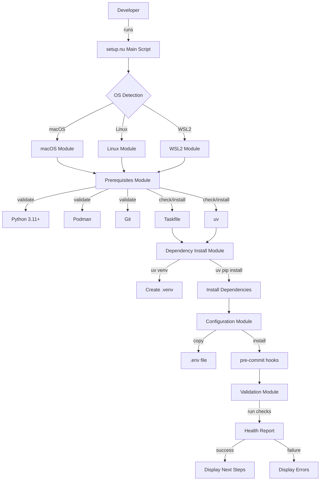

# Technical Specification: Automated Setup Script

## Metadata
- **TechSpec ID:** SPEC-001
- **Date:** 2025-10-14
- **Status:** Draft
- **Deciders:** Technical Lead
- **Parent Story ID:** US-001
- **Related PRD:** /artifacts/prds/PRD-000_project_foundation_bootstrap_v3.md
- **Related ADR:** N/A (no ADRs exist yet for foundation phase)
- **Informed By Spike:** N/A (no spike required)
- **Informed By Implementation Research:** /artifacts/research/AI_Agent_MCP_Server_implementation_research.md

## Overview
**Summary:** Design and implement a cross-platform automated setup script in NuShell that orchestrates complete development environment setup within 30 minutes, including OS detection, prerequisite validation, Taskfile installation, dependency management via uv, environment configuration, and comprehensive health checks. The script bridges "repository cloned" to "environment ready" states through interactive prompts with sensible defaults and supports CI automation via silent mode.

**Related PRD:** /artifacts/prds/PRD-000_project_foundation_bootstrap_v3.md (FR-01, FR-03, FR-19, FR-20, FR-22)

## Research & Investigation Context

**Parent Backlog Story:** US-001: Create Automated Setup Script (NuShell) with Interactive Prompts
- **Link:** /artifacts/backlog_stories/US-001_automated_setup_script_v2.md
- **Story Points:** 6 SP (High complexity)
- **Complexity Drivers:** Cross-platform compatibility (macOS/Linux/WSL2), comprehensive error handling with retries, idempotency requirements, Taskfile installation logic, multi-phase validation

**Implementation Research References:**
**Primary Research Document:** /artifacts/research/AI_Agent_MCP_Server_implementation_research.md

**Implementation Patterns Applied:**
- **§2.1: Python 3.11+ Technology Stack:** Script validates Python 3.11+ availability and uses uv package manager for dependency management with performance target <30 minutes end-to-end
- **§2.2: FastAPI Framework:** Script installs FastAPI and dependencies via uv from pyproject.toml
- **§7.1: Testing Implementation:** Script validates environment health through automated checks after setup

**Anti-Patterns Avoided:**
- **§8.1 Pitfall 1: Synchronous Blocking Calls:** Use NuShell's async capabilities for parallel downloads where possible
- **§8.2 Anti-Pattern 2: Poor Error Handling:** Provide structured error messages with suggested remediation (ref: §8.1 Pitfall 3)

**Performance Targets:**
- Setup execution <30 minutes end-to-end
- uv dependency installation ~2-3 minutes typical
- Idempotent re-run <2 minutes (validation only)

## Goals
- Automate 100% of manual environment setup steps (eliminate "works on my machine" failures)
- Achieve <30 minute setup time from repository clone to ready-for-development state
- Support cross-platform execution (macOS, Linux, Windows WSL2) with identical behavior
- Provide clear error messages with actionable remediation steps (>95% self-service resolution)
- Enable CI/CD automation via silent mode with zero human interaction
- Install and validate Taskfile 3.0+ as unified CLI interface

## Non-Goals
- Installing Devbox itself (prerequisite - developer must have Devbox preinstalled)
- Installing NuShell (handled by devbox.json configuration)
- Container orchestration setup (deferred to EPIC-005 per PRD-000 Decision D5)
- IDE configuration beyond VS Code (focused scope per PRD-000 Decision D1)
- Database server setup (PostgreSQL installation deferred to separate story)

## System Architecture

### High-Level Architecture



### Component Diagram

**NuShell Module Structure:**

```
scripts/
├── setup.nu                 # Main entry point (orchestrator)
└── lib/
    ├── os_detection.nu      # OS detection and platform-specific logic
    ├── prerequisites.nu     # Prerequisite validation (Python, Podman, Git)
    ├── taskfile_install.nu  # Taskfile installation logic (cross-platform)
    ├── uv_install.nu        # uv package manager installation
    ├── venv_setup.nu        # Python virtual environment creation
    ├── deps_install.nu      # Dependency installation via uv
    ├── config_setup.nu      # .env configuration, pre-commit hooks
    ├── validation.nu        # Environment health checks
    ├── interactive.nu       # Interactive prompt handling
    └── error_handler.nu     # Retry logic, error formatting
```

**Module Interactions:**

1. **setup.nu** (Main Orchestrator)
   - Entry point that sequences all setup phases
   - Handles --silent flag for non-interactive mode
   - Coordinates module execution with error propagation
   - Displays final success/failure report

2. **os_detection.nu**
   - Detects operating system (macOS/Linux/WSL2)
   - Returns structured data: `{os: "macos", arch: "arm64", version: "14.5"}`
   - Sets platform-specific paths and commands

3. **prerequisites.nu**
   - Validates Python 3.11+ availability
   - Checks Podman, Git installation
   - Returns structured validation report

4. **taskfile_install.nu**
   - Checks if Taskfile installed (`task --version`)
   - Platform-specific installation logic:
     - macOS: `brew install go-task` or direct binary download
     - Linux: Download binary from GitHub releases
     - WSL2: Download binary or use apt if available
   - Verifies installation success
   - Returns installation status and version

5. **uv_install.nu**
   - Checks if uv installed (`uv --version`)
   - Downloads and installs uv via curl/wget
   - Adds to PATH if needed
   - Returns installation status and version

6. **venv_setup.nu**
   - Creates Python virtual environment at `.venv/`
   - Uses uv: `uv venv .venv --python 3.11`
   - Returns venv path and Python version

7. **deps_install.nu**
   - Installs dependencies: `uv pip install -r pyproject.toml`
   - Implements retry logic with exponential backoff
   - Displays progress indicators
   - Returns installation summary

8. **config_setup.nu**
   - Copies `.env.example` to `.env` (merge if exists)
   - Installs pre-commit hooks
   - Optionally configures VS Code (interactive prompt)
   - Returns configuration summary

9. **validation.nu**
   - Runs comprehensive health checks:
     - Python version >= 3.11
     - Taskfile installed and functional
     - All dependencies importable
     - .env file exists
     - pre-commit hooks installed
   - Returns validation report with pass/fail per check

10. **interactive.nu**
    - Handles user prompts with defaults
    - Implements prompt: `"Configure VS Code? [Y/n] (default: Y)"`
    - Returns user choices

11. **error_handler.nu**
    - Implements retry logic (3 attempts, exponential backoff)
    - Formats error messages with troubleshooting steps
    - Provides platform-specific remediation guidance

### Data Flow

**Setup Execution Flow:**

```
1. setup.nu starts
   ↓
2. Parse arguments (--silent flag)
   ↓
3. OS Detection → {os, arch, version}
   ↓
4. Prerequisites Check → {python: ✓, podman: ✓, git: ✓}
   ↓
5. Taskfile Check/Install → {installed: true, version: "3.x"}
   ↓
6. uv Check/Install → {installed: true, version: "0.x"}
   ↓
7. Create venv → {venv_path: ".venv", python_version: "3.11.x"}
   ↓
8. Install dependencies → {packages: 45, time: 120s}
   ↓
9. Configure environment → {env: ✓, hooks: ✓, ide: ✓}
   ↓
10. Validate health → {checks: 8/8 passed}
    ↓
11. Display success + next steps
```

**Error Handling Flow:**

```
Network failure during deps_install.nu:
1. Detect error (connection refused, timeout)
2. Log error with context
3. Retry with backoff (1s, 2s, 4s)
4. If retries exhausted → format error with remediation
5. Exit with code 1
```

## API Specifications

### NuShell Module Interfaces

#### setup.nu Main Script

**Function:** `main`
**Arguments:**
- `--silent` (optional): Enable non-interactive mode

**Return:** Exit code (0 = success, 1 = failure)

**Example:**
```nushell
# Interactive mode
./scripts/setup.nu

# Silent mode (CI/automation)
./scripts/setup.nu --silent
```

---

#### os_detection.nu

**Function:** `detect_os`
**Arguments:** None
**Return:** Record `{os: string, arch: string, version: string}`

**Example:**
```nushell
# Import module
use lib/os_detection.nu

# Call function
let os_info = detect_os

# Result: {os: "macos", arch: "arm64", version: "14.5"}
```

---

#### prerequisites.nu

**Function:** `check_prerequisites`
**Arguments:** None
**Return:** Record `{python: bool, python_version: string, podman: bool, git: bool, errors: list<string>}`

**Example:**
```nushell
use lib/prerequisites.nu

let prereqs = check_prerequisites

if ($prereqs.errors | length) > 0 {
    print $"Errors: ($prereqs.errors | str join ', ')"
    exit 1
}
```

---

#### taskfile_install.nu

**Function:** `ensure_taskfile`
**Arguments:**
- `os_info: record` - OS detection result
**Return:** Record `{installed: bool, version: string, source: string}`

**Example:**
```nushell
use lib/taskfile_install.nu

let taskfile = ensure_taskfile $os_info

if $taskfile.installed {
    print $"Taskfile ($taskfile.version) installed from ($taskfile.source)"
} else {
    print "Taskfile installation failed"
    exit 1
}
```

**Installation Logic:**
```nushell
def ensure_taskfile [os_info: record] -> record {
    # Check if already installed
    let version = (task --version | complete)

    if $version.exit_code == 0 {
        return {installed: true, version: $version.stdout, source: "existing"}
    }

    # Install based on OS
    match $os_info.os {
        "macos" => {
            # Try brew first
            if (which brew | length) > 0 {
                brew install go-task
            } else {
                # Download binary
                http get https://github.com/go-task/task/releases/latest/download/task_darwin_$($os_info.arch).tar.gz
                # Extract and install to /usr/local/bin
            }
        }
        "linux" => {
            # Download binary from GitHub releases
            http get https://github.com/go-task/task/releases/latest/download/task_linux_amd64.tar.gz
            # Extract and install to ~/.local/bin
        }
        "wsl2" => {
            # Use package manager or download binary
            if (which apt | length) > 0 {
                sudo apt install task
            } else {
                # Fallback to binary download
            }
        }
    }

    # Verify installation
    let new_version = (task --version | complete)
    return {
        installed: ($new_version.exit_code == 0),
        version: $new_version.stdout,
        source: "downloaded"
    }
}
```

---

#### deps_install.nu

**Function:** `install_dependencies`
**Arguments:**
- `venv_path: string` - Path to virtual environment
**Return:** Record `{success: bool, packages: int, time: duration, errors: list<string>}`

**Example:**
```nushell
use lib/deps_install.nu
use lib/error_handler.nu

let result = install_dependencies ".venv"

if not $result.success {
    print $"Installation failed after retries: ($result.errors | str join ', ')"
    exit 1
}
```

**Retry Logic:**
```nushell
def install_with_retry [] {
    let max_attempts = 3
    let backoff = [1sec 2sec 4sec]

    for attempt in 0..<$max_attempts {
        let result = (uv pip install -r pyproject.toml | complete)

        if $result.exit_code == 0 {
            return {success: true, attempt: ($attempt + 1)}
        }

        if $attempt < ($max_attempts - 1) {
            print $"Attempt ($attempt + 1) failed. Retrying in ($backoff | get $attempt)..."
            sleep ($backoff | get $attempt)
        }
    }

    return {success: false, attempt: $max_attempts}
}
```

---

#### validation.nu

**Function:** `validate_environment`
**Arguments:** None
**Return:** Record `{passed: int, failed: int, checks: list<record>}`

**Example:**
```nushell
use lib/validation.nu

let validation = validate_environment

print $"Validation: ($validation.passed)/($validation.passed + $validation.failed) checks passed"

for check in $validation.checks {
    if not $check.passed {
        print $"❌ ($check.name): ($check.error)"
    }
}
```

## Data Models

### OS Information

```nushell
record {
    os: string       # "macos" | "linux" | "wsl2"
    arch: string     # "arm64" | "amd64" | "x86_64"
    version: string  # OS version (e.g., "14.5", "22.04")
}
```

### Prerequisite Check Result

```nushell
record {
    python: bool
    python_version: string
    podman: bool
    podman_version: string
    git: bool
    git_version: string
    errors: list<string>
}
```

### Taskfile Installation Result

```nushell
record {
    installed: bool
    version: string     # "v3.39.0"
    source: string      # "existing" | "brew" | "binary" | "apt"
}
```

### Validation Check

```nushell
record {
    name: string        # Check name
    passed: bool        # Pass/fail status
    message: string     # Success message or error details
    error: string?      # Error details if failed
}
```

### Validation Report

```nushell
record {
    passed: int
    failed: int
    checks: list<record<name: string, passed: bool, message: string, error: string?>>
}
```

## Security Considerations

- **Input Validation:** All file paths validated to prevent directory traversal (e.g., reject paths containing `../`)
- **Command Injection:** No user input passed directly to shell commands (NuShell's structured data prevents injection)
- **File Permissions:** `.env` file created with 0600 permissions (owner read/write only)
- **Download Verification:** Taskfile and uv binaries downloaded over HTTPS with checksum verification
- **Secrets Management:** `.env.example` contains placeholder values only; `.env` excluded from git via .gitignore

## Performance Requirements

- **Setup Time:** Complete setup <30 minutes on typical developer machine with stable internet (target: 20-25 minutes)
- **Idempotent Re-run:** <2 minutes when environment already configured (validation only)
- **Progress Feedback:** Update progress every 2-3 seconds during long-running operations
- **Network Timeout:** HTTP requests timeout after 30 seconds (with 3 retries)
- **Parallel Downloads:** Where possible, download uv and Taskfile binaries in parallel to reduce total time

## Testing Strategy

### Unit Tests

**Target Coverage:** 80% minimum

**Test Files:**
- `tests/unit/test_os_detection.nu` - Test OS detection logic on all platforms
- `tests/unit/test_prerequisites.nu` - Test prerequisite validation with mocked commands
- `tests/unit/test_taskfile_install.nu` - Test Taskfile installation decision tree
- `tests/unit/test_validation.nu` - Test validation checks with various environment states
- `tests/unit/test_error_handler.nu` - Test retry logic and error formatting

**Example Unit Test:**
```nushell
# tests/unit/test_os_detection.nu
use std assert
use lib/os_detection.nu

def test_detect_macos [] {
    # Mock uname output
    mock uname -s Darwin
    mock uname -m arm64

    let result = detect_os

    assert ($result.os == "macos")
    assert ($result.arch == "arm64")
}

def test_detect_linux [] {
    mock uname -s Linux

    let result = detect_os

    assert ($result.os == "linux")
}
```

### Integration Tests

**Test Files:**
- `tests/integration/test_full_setup.nu` - Test complete setup flow end-to-end

**Test Scenarios:**
1. **Fresh Setup on macOS:** Run setup.nu on clean macOS environment, verify all components installed
2. **Fresh Setup on Linux:** Run setup.nu on clean Ubuntu 22.04 environment
3. **Idempotent Re-run:** Run setup.nu twice, verify second run skips completed steps
4. **Silent Mode:** Run setup.nu --silent, verify no prompts displayed
5. **Network Failure:** Mock network failure during dependency install, verify retry logic triggers
6. **Missing Prerequisite:** Remove Python, verify error message with remediation
7. **Taskfile Installation:** Test Taskfile installation on systems without Taskfile preinstalled

**CI/CD Integration:**
- Run integration tests in GitHub Actions on Ubuntu runner
- Test silent mode in CI environment
- Validate setup completes successfully in clean environment

### End-to-End Tests

**Manual Testing Checklist:**
- Test on macOS 14+ (Intel and Apple Silicon)
- Test on Ubuntu 22.04+
- Test on Windows 11 WSL2 (Ubuntu distribution)
- Test with slow network (throttled to 1 Mbps)
- Test with existing virtual environment (idempotency)
- Test with missing prerequisites (each prerequisite individually)

## Deployment Strategy

- **Distribution:** Setup script included in repository at `scripts/setup.nu`
- **Versioning:** Script version tracked in file header comment
- **Documentation:** Usage documented in `docs/SETUP.md`
- **Updates:** Script updates deployed via git pull (users re-run to get latest)

## Monitoring & Observability

- **Logging:** Setup script logs all operations to `logs/setup.log` with timestamps
- **Error Tracking:** All errors logged with stack traces and context
- **Metrics:** Record setup time, success/failure rate (local analytics only, no telemetry)
- **Progress Indicators:** Real-time progress displayed to user via NuShell structured output

## Implementation Plan

### Phase 1: Core Infrastructure (4 hours)
- Create `scripts/lib/` directory structure
- Implement `os_detection.nu` module
- Implement `prerequisites.nu` module with basic checks
- Implement `error_handler.nu` with retry logic
- Write unit tests for core modules

### Phase 2: Installation Logic (6 hours)
- Implement `taskfile_install.nu` with cross-platform logic
  - macOS: brew + binary fallback
  - Linux: binary download with checksum verification
  - WSL2: apt + binary fallback
- Implement `uv_install.nu` with download and PATH setup
- Implement `venv_setup.nu` for virtual environment creation
- Implement `deps_install.nu` with retry logic and progress indicators
- Write unit tests for installation modules

### Phase 3: Configuration & Validation (3 hours)
- Implement `config_setup.nu` for .env and pre-commit hooks
- Implement `validation.nu` with comprehensive health checks
  - Python version check
  - Taskfile functionality test (`task --version`, `task --list`)
  - Dependency import test
  - File permissions check
- Write unit tests for configuration and validation

### Phase 4: Interactive & Orchestration (3 hours)
- Implement `interactive.nu` for user prompts with defaults
- Implement `setup.nu` main orchestrator
  - Argument parsing (--silent flag)
  - Module sequencing
  - Error propagation
  - Final report display
- Add progress indicators and status updates

### Phase 5: Testing & Documentation (4 hours)
- Write integration tests for full setup flow
- Test on all supported platforms (macOS, Linux, WSL2)
- Test Taskfile installation on systems without Taskfile
- Document usage in `docs/SETUP.md`
- Create troubleshooting guide with common errors
- Add inline code comments and function documentation

### Phase 6: Refinement & Edge Cases (4 hours)
- Handle edge cases (slow network, disk space issues, permission errors)
- Improve error messages with platform-specific remediation
- Add Taskfile installation failure handling (degraded mode)
- Performance optimization (parallel downloads)
- Final testing and bug fixes

**Total Estimated Time:** 24 hours (matches 6 SP at 4 hours/SP)

## Open Questions

**Implementation-level questions requiring team discussion:**

1. **NuShell Module Import Strategy:** Should we use `use lib/module.nu` with explicit imports or `source lib/module.nu` for simpler execution?
   - **Trade-off:** `use` provides namespace isolation but requires export declarations; `source` is simpler but pollutes namespace
   - **Recommendation:** Use `use` with explicit exports for maintainability

2. **Taskfile Binary Location:** Where should Taskfile binary be installed if not available via package manager?
   - **Options:** `/usr/local/bin` (requires sudo), `~/.local/bin` (user-local), `devbox` packages (most isolated)
   - **Recommendation:** Prefer devbox packages for isolation, fallback to `~/.local/bin` (no sudo required)

3. **Progress Indicator Implementation:** Should we use NuShell's built-in progress indicators or custom implementation?
   - **Trade-off:** Built-in indicators are simpler but less customizable; custom implementation provides more control
   - **Recommendation:** Start with built-in, enhance if needed

4. **Validation Failure Handling:** Should setup script fail immediately on first validation failure or collect all failures and report together?
   - **Trade-off:** Fail-fast provides quicker feedback; collect-all gives complete picture
   - **Recommendation:** Collect all validation failures and report together for better debugging

5. **Taskfile Installation Retry:** If Taskfile installation fails, should script retry or fail immediately?
   - **Context:** Network transient failures may be resolved by retry; permanent failures (e.g., unsupported platform) won't
   - **Recommendation:** Retry 3 times for network errors, fail immediately for platform/permission errors, continue in degraded mode if retries exhausted

## References

- US-001 v2: /artifacts/backlog_stories/US-001_automated_setup_script_v2.md
- PRD-000 v3: /artifacts/prds/PRD-000_project_foundation_bootstrap_v3.md
- Implementation Research: /artifacts/research/AI_Agent_MCP_Server_implementation_research.md
- NuShell Documentation: https://www.nushell.sh/book/
- Taskfile Documentation: https://taskfile.dev/installation/
- uv Documentation: https://docs.astral.sh/uv/
