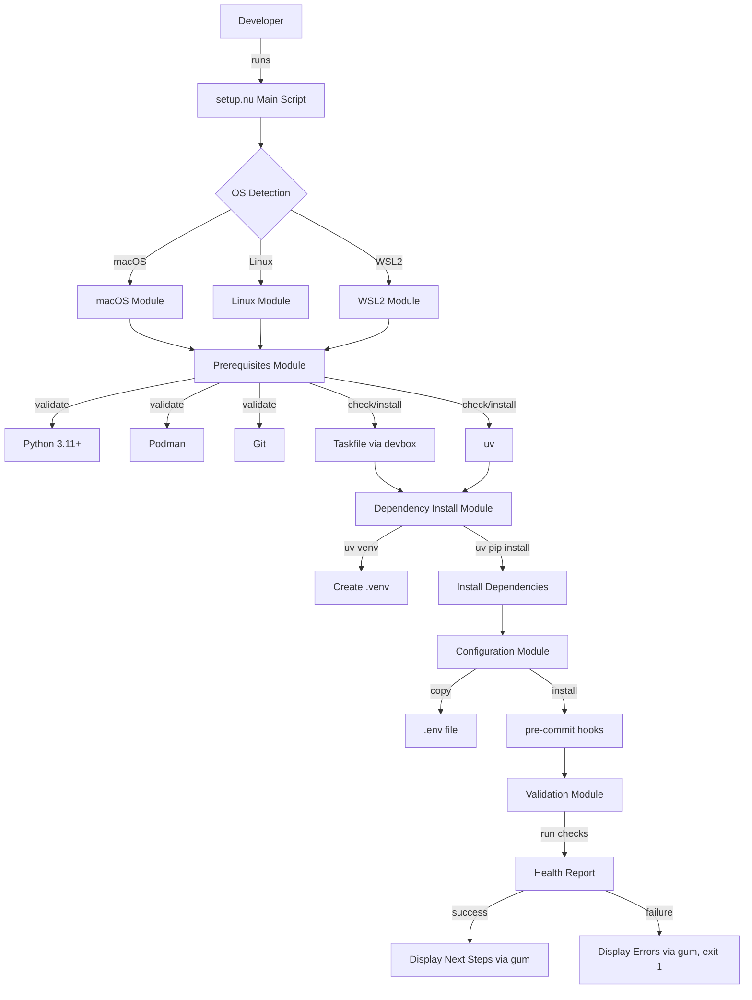

# Technical Specification: Automated Setup Script

## Metadata
- **TechSpec ID:** SPEC-001
- **Date:** 2025-10-14
- **Status:** Proposed
- **Version:** v2
- **Change Summary:** Incorporated feedback decisions (D1-D5) from SPEC-001_v1_comments.md
- **Deciders:** Technical Lead
- **Parent Story ID:** US-001
- **Related PRD:** /artifacts/prds/PRD-000_project_foundation_bootstrap_v3.md
- **Related ADR:** N/A (no ADRs exist yet for foundation phase)
- **Informed By Spike:** N/A (no spike required)
- **Informed By Implementation Research:** /artifacts/research/AI_Agent_MCP_Server_implementation_research.md
- **Informed By Feedback:** /feedback/SPEC-001_v1_comments.md

## Overview
**Summary:** Design and implement a cross-platform automated setup script in NuShell that orchestrates complete development environment setup within 30 minutes, including OS detection, prerequisite validation, Taskfile installation, dependency management via uv, environment configuration, and comprehensive health checks. The script bridges "repository cloned" to "environment ready" states through interactive prompts with sensible defaults and supports CI automation via silent mode. Uses gum for terminal UX and fail-fast error handling.

**Related PRD:** /artifacts/prds/PRD-000_project_foundation_bootstrap_v3.md (FR-01, FR-03, FR-19, FR-20, FR-22)

## Research & Investigation Context

**Parent Backlog Story:** US-001: Create Automated Setup Script (NuShell) with Interactive Prompts
- **Link:** /artifacts/backlog_stories/US-001_automated_setup_script_v2.md
- **Story Points:** 6 SP (High complexity)
- **Complexity Drivers:** Cross-platform compatibility (macOS/Linux/WSL2), comprehensive error handling with retries, idempotency requirements, Taskfile installation logic, multi-phase validation

**Implementation Research References:**
**Primary Research Document:** /artifacts/research/AI_Agent_MCP_Server_implementation_research.md

**Implementation Patterns Applied:**
- **§2.1: Python 3.11+ Technology Stack:** Script validates Python 3.11+ availability and uses uv package manager for dependency management with performance target <30 minutes end-to-end
- **§2.2: FastAPI Framework:** Script installs FastAPI and dependencies via uv from pyproject.toml
- **§7.1: Testing Implementation:** Script validates environment health through automated checks after setup

**Anti-Patterns Avoided:**
- **§8.1 Pitfall 1: Synchronous Blocking Calls:** Use NuShell's async capabilities for parallel downloads where possible
- **§8.2 Anti-Pattern 2: Poor Error Handling:** Provide structured error messages with suggested remediation (ref: §8.1 Pitfall 3)

**Performance Targets:**
- Setup execution <30 minutes end-to-end
- uv dependency installation ~2-3 minutes typical
- Idempotent re-run <2 minutes (validation only)

## Goals
- Automate 100% of manual environment setup steps (eliminate "works on my machine" failures)
- Achieve <30 minute setup time from repository clone to ready-for-development state
- Support cross-platform execution (macOS, Linux, Windows WSL2) with identical behavior
- Provide clear error messages with actionable remediation steps (>95% self-service resolution)
- Enable CI/CD automation via silent mode with zero human interaction
- Install and validate Taskfile 3.0+ as unified CLI interface

## Non-Goals
- Installing Devbox itself (prerequisite - developer must have Devbox preinstalled)
- Installing NuShell (handled by devbox.json configuration)
- Container orchestration setup (deferred to EPIC-005 per PRD-000 Decision D5)
- IDE configuration beyond VS Code (focused scope per PRD-000 Decision D1)
- Database server setup (PostgreSQL installation deferred to separate story)

## Decisions Made (from SPEC-001 v1 Feedback)

**D1 - NuShell Module Import Strategy:** ✅ **DECISION: Use `use` with explicit exports**
- Use `use lib/module.nu` with explicit imports (NOT `source lib/module.nu`)
- Provides namespace isolation and better maintainability
- All modules must use `export def` for public functions
- **Impact:** All module interfaces updated to show explicit exports
- **Rationale:** Prevents namespace pollution, enables better IDE support, aligns with NuShell best practices

**D2 - Taskfile Binary Location:** ✅ **DECISION: Install via devbox**
- Prefer devbox packages for Taskfile installation (maximum isolation)
- **Impact:** `taskfile_install.nu` prioritizes devbox integration
- **Rationale:** Devbox provides best isolation and version management

**D3 - Progress Indicator Implementation:** ✅ **DECISION: Use gum for terminal UX**
- Use gum (https://github.com/charmbracelet/gum) for progress indicators and terminal UI
- Provides better UX than NuShell built-in indicators
- **Impact:** Add gum to devbox.json, update `interactive.nu` and error display
- **Rationale:** gum provides professional terminal UI with spinners, progress bars, and styled output

**D4 - Validation Failure Handling:** ✅ **DECISION: Fail-fast**
- Setup script fails immediately on first validation failure
- Prerequisite modules still collect complete reports (better UX), but setup script exits if any errors found
- **Impact:** `setup.nu` checks validation results and exits immediately on failure
- **Rationale:** Faster feedback loop, prevents wasted time on doomed setups

**D5 - Taskfile Installation Retry:** ✅ **DECISION: Retry with degraded mode fallback**
- Retry 3 times for network errors (exponential backoff)
- Fail immediately for platform/permission errors
- Continue in degraded mode if retries exhausted (log warning, continue without Taskfile)
- **Impact:** `taskfile_install.nu` implements smart retry logic
- **Rationale:** Balances robustness (handle transient failures) with usability (don't block setup on Taskfile issues)

## System Architecture

### High-Level Architecture



### Component Diagram

**NuShell Module Structure (per Decision D1 - explicit exports):**

```
scripts/
├── setup.nu                 # Main entry point (orchestrator)
└── lib/
    ├── os_detection.nu      # OS detection (export def detect_os)
    ├── prerequisites.nu     # Prerequisite validation (export def check_prerequisites)
    ├── taskfile_install.nu  # Taskfile installation via devbox (export def ensure_taskfile)
    ├── uv_install.nu        # uv package manager installation (export def ensure_uv)
    ├── venv_setup.nu        # Python venv creation (export def create_venv)
    ├── deps_install.nu      # Dependency installation (export def install_dependencies)
    ├── config_setup.nu      # .env configuration, pre-commit hooks (export def setup_config)
    ├── validation.nu        # Environment health checks (export def validate_environment)
    ├── interactive.nu       # Interactive prompts via gum (export def prompt_user)
    └── error_handler.nu     # Retry logic, error formatting (export def retry_with_backoff)

NOTE: All modules use explicit exports (export def) per Decision D1
      Import pattern: use scripts/lib/module.nu function_name
```

**Module Interactions:**

1. **setup.nu** (Main Orchestrator)
   - Entry point that sequences all setup phases
   - Handles --silent flag for non-interactive mode
   - Coordinates module execution with error propagation
   - **Per D4:** Exits immediately if any validation returns errors (fail-fast)
   - **Per D3:** Uses gum for final success/failure report display

2. **os_detection.nu**
   - **Exported Function:** `export def detect_os`
   - Detects operating system (macOS/Linux/WSL2)
   - Returns structured data: `{os: "macos", arch: "arm64", version: "14.5"}`
   - Sets platform-specific paths and commands

3. **prerequisites.nu**
   - **Exported Function:** `export def check_prerequisites`
   - Validates Python 3.11+ availability
   - Checks Podman, Git installation
   - Returns structured validation report
   - **Per D4:** Collects ALL errors for complete report, but setup.nu exits immediately if errors exist

4. **taskfile_install.nu**
   - **Exported Function:** `export def ensure_taskfile`
   - **Per D2:** Prioritizes devbox installation (`devbox add task`)
   - **Per D5:** Retries 3 times for network errors, fails fast for platform errors, continues in degraded mode if exhausted
   - Platform-specific installation logic:
     - macOS: devbox add task (preferred) → brew → binary download
     - Linux: devbox add task (preferred) → binary download
     - WSL2: devbox add task (preferred) → apt → binary download
   - Verifies installation success
   - Returns installation status and version

5. **uv_install.nu**
   - **Exported Function:** `export def ensure_uv`
   - Checks if uv installed (`uv --version`)
   - Downloads and installs uv via curl/wget
   - Adds to PATH if needed
   - Returns installation status and version

6. **venv_setup.nu**
   - **Exported Function:** `export def create_venv`
   - Creates Python virtual environment at `.venv/`
   - Uses uv: `uv venv .venv --python 3.11`
   - Returns venv path and Python version

7. **deps_install.nu**
   - **Exported Function:** `export def install_dependencies`
   - Installs dependencies: `uv pip install -r pyproject.toml`
   - Implements retry logic with exponential backoff
   - **Per D3:** Displays progress indicators via gum spinner
   - Returns installation summary

8. **config_setup.nu**
   - **Exported Function:** `export def setup_config`
   - Copies `.env.example` to `.env` (merge if exists)
   - Installs pre-commit hooks
   - **Per D3:** Optionally configures VS Code (interactive prompt via gum)
   - Returns configuration summary

9. **validation.nu**
   - **Exported Function:** `export def validate_environment`
   - Runs comprehensive health checks:
     - Python version >= 3.11
     - Taskfile installed and functional
     - All dependencies importable
     - .env file exists
     - pre-commit hooks installed
   - Returns validation report with pass/fail per check
   - **Per D4:** Setup script exits immediately if any check fails

10. **interactive.nu**
    - **Exported Function:** `export def prompt_user`
    - **Per D3:** Uses gum for interactive prompts (`gum input`, `gum confirm`)
    - Implements prompt: `gum confirm "Configure VS Code?" --default=yes`
    - Returns user choices

11. **error_handler.nu**
    - **Exported Function:** `export def retry_with_backoff`
    - Implements retry logic (3 attempts, exponential backoff: 1s, 2s, 4s)
    - **Per D3:** Formats error messages with gum styling (`gum style --foreground 196`)
    - Provides platform-specific remediation guidance

### Data Flow

**Setup Execution Flow:**

```
1. setup.nu starts
   ↓
2. Parse arguments (--silent flag)
   ↓
3. OS Detection → {os, arch, version}
   ↓
4. Prerequisites Check → {python: ✓, podman: ✓, git: ✓}
   [Per D4: If errors exist → display via gum, exit 1 immediately]
   ↓
5. Taskfile Check/Install → {installed: true, version: "3.x"}
   [Per D2: Try devbox first]
   [Per D5: Retry 3x for network errors, continue degraded mode if fail]
   ↓
6. uv Check/Install → {installed: true, version: "0.x"}
   ↓
7. Create venv → {venv_path: ".venv", python_version: "3.11.x"}
   ↓
8. Install dependencies → {packages: 45, time: 120s}
   [Per D3: Show gum spinner during install]
   ↓
9. Configure environment → {env: ✓, hooks: ✓, ide: ✓}
   [Per D3: Use gum confirm for IDE setup prompt]
   ↓
10. Validate health → {checks: 8/8 passed}
    [Per D4: If any check fails → display errors via gum, exit 1]
    ↓
11. Display success + next steps (via gum style)
```

**Error Handling Flow:**

```
Network failure during deps_install.nu:
1. Detect error (connection refused, timeout)
2. Log error with context
3. Retry with backoff (1s, 2s, 4s) [Per D5]
4. If retries exhausted → format error with gum styling [Per D3]
5. Exit with code 1 [Per D4: fail-fast]
```

## API Specifications

### NuShell Module Interfaces

**NOTE:** All modules use explicit exports per Decision D1. Import pattern: `use scripts/lib/module.nu function_name`

#### setup.nu Main Script

**Function:** `main`
**Arguments:**
- `--silent` (optional): Enable non-interactive mode

**Return:** Exit code (0 = success, 1 = failure)

**Example:**
```nushell
# Interactive mode (with gum prompts)
./scripts/setup.nu

# Silent mode (CI/automation)
./scripts/setup.nu --silent
```

---

#### os_detection.nu

**Function:** `detect_os` (explicitly exported via `export def`)
**Arguments:** None
**Return:** Record `{os: string, arch: string, version: string}`

**Example:**
```nushell
# Import module with explicit function import (per D1)
use scripts/lib/os_detection.nu detect_os

# Call function
let os_info = (detect_os)

# Result: {os: "macos", arch: "arm64", version: "14.5"}
```

---

#### prerequisites.nu

**Function:** `check_prerequisites` (explicitly exported via `export def`)
**Arguments:** None
**Return:** Record `{python: bool, python_version: string, podman: bool, git: bool, errors: list<string>}`

**Example:**
```nushell
use scripts/lib/prerequisites.nu check_prerequisites

let prereqs = (check_prerequisites)

# Per D4: Fail-fast if errors exist
if ($prereqs.errors | length) > 0 {
    # Display errors via gum (per D3)
    gum style --foreground 196 --bold "Prerequisites check failed:"
    $prereqs.errors | each { |err| gum style --foreground 196 $"  ✗ ($err)" }
    exit 1  # Fail-fast
}
```

---

#### taskfile_install.nu

**Function:** `ensure_taskfile` (explicitly exported via `export def`)
**Arguments:**
- `os_info: record` - OS detection result
**Return:** Record `{installed: bool, version: string, source: string, degraded_mode: bool}`

**Example:**
```nushell
use scripts/lib/taskfile_install.nu ensure_taskfile

let taskfile = (ensure_taskfile $os_info)

if $taskfile.installed {
    gum style --foreground 35 $"✓ Taskfile ($taskfile.version) installed from ($taskfile.source)"
} else if $taskfile.degraded_mode {
    # Per D5: Continue in degraded mode
    gum style --foreground 214 "⚠ Taskfile installation failed. Continuing in degraded mode."
} else {
    gum style --foreground 196 "✗ Taskfile installation failed"
    exit 1
}
```

**Installation Logic (incorporating D2, D5):**
```nushell
# Explicitly exported function (per D1)
export def ensure_taskfile [os_info: record] -> record {
    # Check if already installed
    let version = (task --version | complete)

    if $version.exit_code == 0 {
        return {installed: true, version: $version.stdout, source: "existing", degraded_mode: false}
    }

    # Per D2: Try devbox first (most isolated)
    gum spin --spinner dot --title "Installing Taskfile via devbox..." -- devbox add task

    let devbox_check = (task --version | complete)
    if $devbox_check.exit_code == 0 {
        return {installed: true, version: $devbox_check.stdout, source: "devbox", degraded_mode: false}
    }

    # Per D5: Retry installation with platform-specific fallback
    let install_result = retry_taskfile_install $os_info

    if $install_result.success {
        return {installed: true, version: $install_result.version, source: $install_result.source, degraded_mode: false}
    }

    # Per D5: Continue in degraded mode if all retries exhausted
    gum style --foreground 214 "Warning: Taskfile installation failed after 3 retries. Continuing without Taskfile."
    return {installed: false, version: "", source: "none", degraded_mode: true}
}

# Retry logic with exponential backoff (per D5)
def retry_taskfile_install [os_info: record] -> record {
    let max_attempts = 3
    let backoff = [1sec 2sec 4sec]

    for attempt in 0..<$max_attempts {
        let result = install_taskfile_binary $os_info

        if $result.success {
            return {success: true, version: $result.version, source: $result.source}
        }

        # Per D5: Fail immediately for platform/permission errors
        if $result.error_type in ["platform_unsupported", "permission_denied"] {
            return {success: false, version: "", source: "none"}
        }

        # Retry for network errors
        if $attempt < ($max_attempts - 1) {
            let wait_time = ($backoff | get $attempt)
            gum spin --spinner dot --title $"Retry ($attempt + 1)/($max_attempts) in ($wait_time)..." -- sleep $wait_time
        }
    }

    return {success: false, version: "", source: "none"}
}
```

---

#### deps_install.nu

**Function:** `install_dependencies` (explicitly exported via `export def`)
**Arguments:**
- `venv_path: string` - Path to virtual environment
**Return:** Record `{success: bool, packages: int, time: duration, errors: list<string>}`

**Example:**
```nushell
use scripts/lib/deps_install.nu install_dependencies
use scripts/lib/error_handler.nu retry_with_backoff

# Per D3: Show gum spinner during installation
let result = (gum spin --spinner dot --title "Installing dependencies..." -- install_dependencies ".venv")

if not $result.success {
    # Per D3: Display error via gum styling
    gum style --foreground 196 --bold $"Installation failed after retries: ($result.errors | str join ', ')"
    # Per D4: Fail-fast
    exit 1
}

gum style --foreground 35 $"✓ Installed ($result.packages) packages in ($result.time)"
```

**Retry Logic (incorporating D3, D5):**
```nushell
export def install_with_retry [] {
    let max_attempts = 3
    let backoff = [1sec 2sec 4sec]

    for attempt in 0..<$max_attempts {
        let result = (uv pip install -r pyproject.toml | complete)

        if $result.exit_code == 0 {
            return {success: true, attempt: ($attempt + 1)}
        }

        if $attempt < ($max_attempts - 1) {
            let wait_time = ($backoff | get $attempt)
            # Per D3: Use gum for retry feedback
            gum style --foreground 214 $"Attempt ($attempt + 1) failed. Retrying in ($wait_time)..."
            sleep $wait_time
        }
    }

    return {success: false, attempt: $max_attempts}
}
```

---

#### validation.nu

**Function:** `validate_environment` (explicitly exported via `export def`)
**Arguments:** None
**Return:** Record `{passed: int, failed: int, checks: list<record>}`

**Example:**
```nushell
use scripts/lib/validation.nu validate_environment

# Per D3: Show gum spinner during validation
let validation = (gum spin --spinner dot --title "Validating environment..." -- validate_environment)

gum style --foreground 35 $"Validation: ($validation.passed)/($validation.passed + $validation.failed) checks passed"

# Per D4: Fail-fast if any check failed
for check in $validation.checks {
    if not $check.passed {
        gum style --foreground 196 $"✗ ($check.name): ($check.error)"
    }
}

if $validation.failed > 0 {
    exit 1  # Fail-fast per D4
}
```

---

#### interactive.nu (incorporating D3)

**Function:** `prompt_user` (explicitly exported via `export def`)
**Arguments:**
- `question: string` - Prompt question
- `default: bool` - Default value (true/false)
**Return:** bool

**Example using gum (per D3):**
```nushell
export def prompt_user [question: string, default: bool] -> bool {
    if $default {
        gum confirm $question --default=yes
    } else {
        gum confirm $question --default=no
    }

    return ($env.LAST_EXIT_CODE == 0)
}
```

---

## Data Models

### OS Information

```nushell
record {
    os: string       # "macos" | "linux" | "wsl2"
    arch: string     # "arm64" | "amd64" | "x86_64"
    version: string  # OS version (e.g., "14.5", "22.04")
}
```

### Prerequisite Check Result

```nushell
record {
    python: bool
    python_version: string
    podman: bool
    podman_version: string
    git: bool
    git_version: string
    errors: list<string>
}
```

### Taskfile Installation Result (updated for D5)

```nushell
record {
    installed: bool
    version: string           # "v3.39.0"
    source: string            # "existing" | "devbox" | "brew" | "binary" | "apt" | "none"
    degraded_mode: bool       # true if continuing without Taskfile (per D5)
}
```

### Validation Check

```nushell
record {
    name: string        # Check name
    passed: bool        # Pass/fail status
    message: string     # Success message or error details
    error: string?      # Error details if failed
}
```

### Validation Report

```nushell
record {
    passed: int
    failed: int
    checks: list<record<name: string, passed: bool, message: string, error: string?>>
}
```

## Security Considerations

- **Input Validation:** All file paths validated to prevent directory traversal (e.g., reject paths containing `../`)
- **Command Injection:** No user input passed directly to shell commands (NuShell's structured data prevents injection)
- **File Permissions:** `.env` file created with 0600 permissions (owner read/write only)
- **Download Verification:** Taskfile and uv binaries downloaded over HTTPS with checksum verification
- **Secrets Management:** `.env.example` contains placeholder values only; `.env` excluded from git via .gitignore
- **gum Safety:** gum inputs sanitized to prevent command injection

## Performance Requirements

- **Setup Time:** Complete setup <30 minutes on typical developer machine with stable internet (target: 20-25 minutes)
- **Idempotent Re-run:** <2 minutes when environment already configured (validation only)
- **Progress Feedback:** Update progress every 2-3 seconds during long-running operations (via gum spinners per D3)
- **Network Timeout:** HTTP requests timeout after 30 seconds (with 3 retries per D5)
- **Parallel Downloads:** Where possible, download uv and Taskfile binaries in parallel to reduce total time
- **gum Overhead:** gum styling/prompts add <100ms overhead per operation (negligible)

## Testing Strategy

### Unit Tests

**Target Coverage:** 80% minimum

**Test Files:**
- `tests/unit/test_os_detection.nu` - Test OS detection logic on all platforms
- `tests/unit/test_prerequisites.nu` - Test prerequisite validation with mocked commands
- `tests/unit/test_taskfile_install.nu` - Test Taskfile installation with devbox priority (D2) and retry logic (D5)
- `tests/unit/test_validation.nu` - Test validation checks with various environment states
- `tests/unit/test_error_handler.nu` - Test retry logic and error formatting
- `tests/unit/test_interactive.nu` - Test gum prompt integration (D3)

**Example Unit Test (incorporating D1):**
```nushell
# tests/unit/test_os_detection.nu
use std assert
use scripts/lib/os_detection.nu detect_os  # Explicit import per D1

def test_detect_macos [] {
    let result = (detect_os)

    assert ($result.os == "macos")
    assert ($result.arch in ["x86_64", "arm64"])
}

def test_detect_linux [] {
    # Mock /proc/version to simulate non-WSL Linux
    let result = (detect_os)

    assert ($result.os in ["linux", "wsl2"])
}

# Run tests
test_detect_macos
test_detect_linux
```

### Integration Tests

**Test Files:**
- `tests/integration/test_full_setup.nu` - Test complete setup flow end-to-end

**Test Scenarios:**
1. **Fresh Setup on macOS:** Run setup.nu on clean macOS environment, verify all components installed
2. **Fresh Setup on Linux:** Run setup.nu on clean Ubuntu 22.04 environment
3. **Idempotent Re-run:** Run setup.nu twice, verify second run skips completed steps
4. **Silent Mode:** Run setup.nu --silent, verify no gum prompts displayed (per D3)
5. **Network Failure:** Mock network failure during dependency install, verify retry logic triggers (per D5)
6. **Missing Prerequisite:** Remove Python, verify error message via gum and fail-fast (per D3, D4)
7. **Taskfile Installation:** Test devbox priority (D2) and degraded mode fallback (D5)
8. **Validation Failure:** Simulate validation check failure, verify fail-fast behavior (D4)

**CI/CD Integration:**
- Run integration tests in GitHub Actions on Ubuntu runner
- Test silent mode in CI environment
- Validate setup completes successfully in clean environment
- Test fail-fast behavior (D4) in CI

### End-to-End Tests

**Manual Testing Checklist:**
- Test on macOS 14+ (Intel and Apple Silicon)
- Test on Ubuntu 22.04+
- Test on Windows 11 WSL2 (Ubuntu distribution)
- Test with slow network (throttled to 1 Mbps) - verify retries (D5)
- Test with existing virtual environment (idempotency)
- Test with missing prerequisites (verify fail-fast per D4)
- Test gum integration (D3): spinners, prompts, error styling
- Test Taskfile devbox installation (D2)
- Test degraded mode (D5): Taskfile unavailable scenario

## Deployment Strategy

- **Distribution:** Setup script included in repository at `scripts/setup.nu`
- **Versioning:** Script version tracked in file header comment
- **Documentation:** Usage documented in `docs/SETUP.md`
- **Updates:** Script updates deployed via git pull (users re-run to get latest)
- **Dependencies:** gum added to devbox.json (per D3)

## Monitoring & Observability

- **Logging:** Setup script logs all operations to `logs/setup.log` with timestamps
- **Error Tracking:** All errors logged with stack traces and context, displayed via gum styling (per D3)
- **Metrics:** Record setup time, success/failure rate (local analytics only, no telemetry)
- **Progress Indicators:** Real-time progress displayed via gum spinners and progress bars (per D3)
- **Fail-Fast Tracking:** Log when setup exits early due to validation failures (per D4)

## Implementation Plan

### Phase 1: Core Infrastructure (4 hours)
- Create `scripts/lib/` directory structure
- Implement `os_detection.nu` module with **explicit exports** (per D1)
- Implement `prerequisites.nu` module with basic checks and **explicit exports** (per D1)
- Implement `error_handler.nu` with retry logic (per D5) and **explicit exports** (per D1)
- Add gum to devbox.json (per D3)
- Write unit tests for core modules

### Phase 2: Installation Logic (6 hours)
- Implement `taskfile_install.nu` with **devbox priority** (per D2), retry logic (per D5), and **explicit exports** (per D1)
  - Primary: devbox add task
  - Fallback: brew (macOS) / binary download (Linux/WSL2)
  - Degraded mode: Continue without Taskfile if all retries fail
- Implement `uv_install.nu` with download and PATH setup, **explicit exports** (per D1)
- Implement `venv_setup.nu` for virtual environment creation, **explicit exports** (per D1)
- Implement `deps_install.nu` with retry logic (per D5) and **gum spinners** (per D3), **explicit exports** (per D1)
- Write unit tests for installation modules

### Phase 3: Configuration & Validation (3 hours)
- Implement `config_setup.nu` for .env and pre-commit hooks, **explicit exports** (per D1)
- Implement `validation.nu` with comprehensive health checks, **explicit exports** (per D1)
  - Python version check
  - Taskfile functionality test (`task --version`, `task --list`)
  - Dependency import test
  - File permissions check
- Implement **fail-fast exit** on validation failure (per D4)
- Write unit tests for configuration and validation

### Phase 4: Interactive & Orchestration (3 hours)
- Implement `interactive.nu` for **gum-based prompts** (per D3), **explicit exports** (per D1)
  - `gum confirm` for yes/no prompts
  - `gum input` for text input
  - `gum style` for styled output
- Implement `setup.nu` main orchestrator with **explicit imports** (per D1)
  - Argument parsing (--silent flag)
  - Module sequencing
  - **Fail-fast error propagation** (per D4)
  - Final report display via gum (per D3)
- Add **gum spinners** for progress feedback (per D3)

### Phase 5: Testing & Documentation (4 hours)
- Write integration tests for full setup flow
- Test on all supported platforms (macOS, Linux, WSL2)
- Test Taskfile devbox installation (D2) and degraded mode (D5)
- Test fail-fast behavior (D4) with validation failures
- Test gum integration (D3): spinners, prompts, error styling
- Document usage in `docs/SETUP.md`
- Create troubleshooting guide with common errors
- Add inline code comments and function documentation

### Phase 6: Refinement & Edge Cases (4 hours)
- Handle edge cases (slow network, disk space issues, permission errors)
- Improve error messages with **gum styling** and platform-specific remediation (per D3)
- Add Taskfile installation failure handling with **degraded mode** (per D5)
- Performance optimization (parallel downloads)
- Final testing and bug fixes
- Verify all decisions (D1-D5) properly implemented

**Total Estimated Time:** 24 hours (matches 6 SP at 4 hours/SP)

## References

- US-001 v2: /artifacts/backlog_stories/US-001_automated_setup_script_v2.md
- PRD-000 v3: /artifacts/prds/PRD-000_project_foundation_bootstrap_v3.md
- Implementation Research: /artifacts/research/AI_Agent_MCP_Server_implementation_research.md
- SPEC-001 v1 Feedback: /feedback/SPEC-001_v1_comments.md
- NuShell Documentation: https://www.nushell.sh/book/
- NuShell Modules: https://www.nushell.sh/book/modules.html
- Taskfile Documentation: https://taskfile.dev/installation/
- uv Documentation: https://docs.astral.sh/uv/
- gum Documentation: https://github.com/charmbracelet/gum

## Changes from v1

**Summary:** Converted Open Questions to Decisions based on SPEC-001_v1_comments.md feedback

**Decisions Implemented:**
- **D1:** Use `use` with explicit exports - Updated all module interfaces to show `export def` pattern
- **D2:** Install Taskfile via devbox - Updated taskfile_install.nu to prioritize devbox
- **D3:** Use gum for terminal UX - Integrated gum throughout for spinners, prompts, error styling
- **D4:** Fail-fast on validation failures - Updated setup.nu flow to exit immediately on errors
- **D5:** Retry with degraded mode fallback - Updated taskfile_install.nu with smart retry and degraded mode

**Sections Updated:**
- Metadata: Changed status to "Proposed", added version and feedback reference
- Overview: Added gum and fail-fast mentions
- Decisions Made: New section replacing "Open Questions"
- System Architecture: Updated component diagram and module interactions to reflect decisions
- API Specifications: Updated all examples to show explicit imports and gum integration
- Data Models: Added degraded_mode field to Taskfile Installation Result
- Testing Strategy: Added tests for new decision implementations
- Implementation Plan: Updated all phases to incorporate decisions
- References: Added gum documentation and feedback reference
