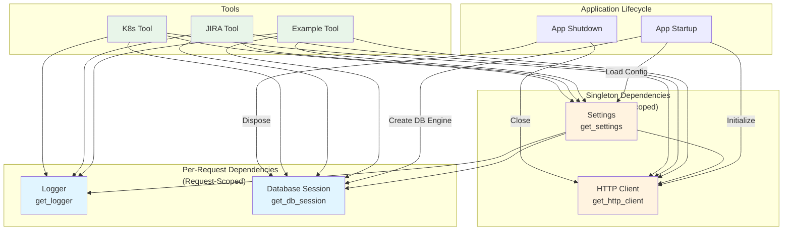

# Dependency Injection Pattern

**Last Updated**: 2025-10-15
**Version**: 1.0
**Status**: Active

## Purpose

This document explains the dependency injection (DI) pattern used throughout the MCP server, providing both conceptual understanding and practical guidance for extending the system with new dependencies.

**After reading this document, you should be able to**:
- Understand WHY dependency injection is used
- Identify the four core dependencies and their lifecycles
- Add new dependencies following established patterns
- Test code using dependency injection

**Target Audience**: Engineers implementing new tools or extending core services.

---

## Why Dependency Injection?

**The Problem Without DI**: Traditional approaches use global variables or direct imports:

```python
# ❌ BAD: Global variables and direct imports
from mcp_server.config import settings  # Global singleton
import logging

logger = logging.getLogger("mcp_server")  # Global logger

async def my_tool(params: MyInput) -> MyOutput:
    # Hidden dependencies make testing difficult
    # How do you mock settings or logger for testing?
    logger.info(f"Running in {settings.environment}")
    ...
```

**Problems**:
1. **Testing Difficulty**: Can't easily mock dependencies - requires monkey-patching or global state manipulation
2. **Hidden Dependencies**: Function signature doesn't reveal what services it needs
3. **Inflexibility**: Can't swap implementations per environment (dev vs prod)
4. **Coupling**: Code is tightly coupled to specific implementations

**The DI Solution**: Explicitly pass dependencies as function parameters:

```python
# ✅ GOOD: Explicit dependency injection
async def my_tool(
    params: MyInput,
    settings: SettingsDep,
    logger: LoggerDep,
) -> MyOutput:
    # Clear what dependencies this function needs
    # Easy to mock in tests
    logger.info(f"Running in {settings.environment}")
    ...
```

**Benefits**:
1. **Testability**: Mock dependencies easily in tests
2. **Explicitness**: Function signature shows all dependencies
3. **Flexibility**: Different dependencies per environment
4. **Decoupling**: Code depends on interfaces, not implementations

---

## Core Dependencies

The MCP server provides four core dependencies. Each has a specific lifecycle and purpose.

### 1. Settings (`SettingsDep`)

**Purpose**: Application configuration loaded from environment variables and `.env` file.

**Lifecycle**: Application-scoped (singleton) - same instance across all requests.

**Type Definition**:
```python
SettingsDep = Annotated[Settings, Depends(get_settings)]
```

**Usage Example**:
```python
from mcp_server.core.dependencies import SettingsDep

async def my_tool(settings: SettingsDep) -> dict:
    return {
        "app_name": settings.app_name,
        "environment": settings.environment,
        "debug_mode": settings.debug,
    }
```

**Implementation**: See `src/mcp_server/core/dependencies.py:28-50`

**When to Use**: Access application configuration (API keys, database URLs, feature flags, etc.)

---

### 2. Logger (`LoggerDep`)

**Purpose**: Structured logging with contextual information (timestamp, log level, module name).

**Lifecycle**: Request-scoped - new logger instance per request (or reuse if name matches).

**Type Definition**:
```python
LoggerDep = Annotated[logging.Logger, Depends(get_logger)]
```

**Usage Example**:
```python
from mcp_server.core.dependencies import LoggerDep

async def my_tool(logger: LoggerDep) -> dict:
    logger.info("Tool invoked", extra={"tool": "my_tool"})
    logger.debug("Processing data", extra={"data_size": 1024})
    return {"status": "success"}
```

**Implementation**: See `src/mcp_server/core/dependencies.py:53-96`

**When to Use**: Log tool execution, errors, performance metrics, debugging information.

**Logging Best Practices**:
- Use structured logging with `extra` dict for key-value pairs
- Log at appropriate levels (DEBUG, INFO, WARNING, ERROR, CRITICAL)
- Include contextual information (user ID, request ID, tool name)
- Avoid logging sensitive data (passwords, API keys, PII)

---

### 3. Database Session (`SessionDep`)

**Purpose**: SQLAlchemy AsyncSession for database queries with automatic cleanup.

**Lifecycle**: Request-scoped - new session per request, automatically committed/rolled back and closed.

**Type Definition**:
```python
SessionDep = Annotated[AsyncSession, Depends(get_db_session)]
```

**Usage Example**:
```python
from mcp_server.core.dependencies import SessionDep
from sqlalchemy import select
from mcp_server.models import User

async def my_tool(session: SessionDep) -> dict:
    # Query database
    result = await session.execute(select(User).where(User.active == True))
    users = result.scalars().all()

    # Session auto-commits on success, auto-rolls back on exception
    return {"user_count": len(users)}
```

**Implementation**: See `src/mcp_server/core/dependencies.py:99-138`

**When to Use**: Persist or query data from PostgreSQL database.

**Database Best Practices**:
- Use async queries (`await session.execute()`)
- Session automatically commits on success, rolls back on exception
- Connection pooling enabled (reuses connections for performance)
- Don't manually commit/rollback (dependency handles it)

---

### 4. HTTP Client (`HttpClientDep`)

**Purpose**: Shared `httpx.AsyncClient` for external API calls with connection pooling.

**Lifecycle**: Application-scoped (singleton) - same client instance across all requests.

**Type Definition**:
```python
HttpClientDep = Annotated[httpx.AsyncClient, Depends(get_http_client)]
```

**Usage Example**:
```python
from mcp_server.core.dependencies import HttpClientDep

async def my_tool(client: HttpClientDep) -> dict:
    # Make external API call
    response = await client.get("https://api.example.com/data")
    response.raise_for_status()  # Raise on 4xx/5xx

    return {"data": response.json()}
```

**Implementation**: See `src/mcp_server/core/dependencies.py:140-169`

**When to Use**: Call external REST APIs (JIRA, GitHub, Kubernetes, etc.).

**HTTP Best Practices**:
- Connection pooling enabled (reuses connections for performance)
- Client is shared across requests (don't create new clients)
- Handle timeouts and retries appropriately
- Use `response.raise_for_status()` to detect errors

---

## Dependency Graph



**Key Observations**:
- **Singleton dependencies** (Settings, HTTP Client) initialized once at app startup
- **Request-scoped dependencies** (Logger, DB Session) created per request and cleaned up automatically
- **Tools** can depend on any combination of dependencies
- Settings dependency used by other dependencies (Logger, DB Session configuration)

---

## How to Add a New Dependency

Follow this step-by-step guide to add new shared services.

### Step 1: Create Dependency Provider Function

Add provider function in `src/mcp_server/core/dependencies.py`:

```python
# Example: Add Redis cache client

import redis.asyncio as redis

# Module-level variable for application-scoped resource
_redis_client: redis.Redis | None = None


def get_redis_client() -> redis.Redis:
    """
    Get shared Redis client with connection pooling.

    Returns the shared Redis client instance created at application startup.
    The client reuses connections for caching operations.

    Lifecycle: Application-scoped (singleton, shared across all requests)

    Returns:
        redis.Redis: Shared Redis client instance

    Example:
        ```python
        async def my_tool(cache: RedisDep) -> dict:
            await cache.set("key", "value", ex=3600)
            value = await cache.get("key")
            return {"value": value}
        ```

    Note:
        Redis client must be initialized during application startup via
        initialize_redis_client(). This function will raise an error if called
        before initialization.
    """
    if _redis_client is None:
        raise RuntimeError(
            "Redis client not initialized. Call initialize_redis_client() during app startup."
        )
    return _redis_client
```

### Step 2: Create Type Alias

Add type alias after provider function:

```python
# Type alias for dependency injection
RedisDep = Annotated[redis.Redis, Depends(get_redis_client)]
```

### Step 3: Add Lifecycle Management

Add initialization and cleanup functions:

```python
async def initialize_redis_client() -> None:
    """
    Initialize shared Redis client at application startup.

    Creates a shared Redis client instance with connection pooling enabled.
    Should be called once during application startup in the lifespan context manager.

    Raises:
        RuntimeError: If Redis client already initialized
    """
    global _redis_client
    if _redis_client is not None:
        raise RuntimeError("Redis client already initialized")

    settings = get_settings()
    _redis_client = redis.Redis(
        host=settings.redis_host,
        port=settings.redis_port,
        password=settings.redis_password,
        decode_responses=True,
    )


async def close_redis_client() -> None:
    """
    Close shared Redis client at application shutdown.

    Closes the shared Redis client instance and releases all connections.
    Should be called once during application shutdown in the lifespan context manager.
    """
    global _redis_client
    if _redis_client is not None:
        await _redis_client.close()
        _redis_client = None
```

### Step 4: Register in Application Lifespan

Update `src/mcp_server/main.py` lifespan context manager:

```python
from mcp_server.core.dependencies import (
    initialize_redis_client,  # Add import
    close_redis_client,       # Add import
    # ... other imports
)

@asynccontextmanager
async def lifespan(_app: FastAPI) -> AsyncIterator[None]:
    global _startup_time

    # Startup
    configure_logging()
    logger = structlog.get_logger()
    _startup_time = time.time()

    # ... existing startup code ...

    await initialize_redis_client()  # Add initialization
    logger.info("redis_client_initialized")

    yield

    # Shutdown
    logger.info("application_shutdown_started")

    # ... existing shutdown code ...

    await close_redis_client()  # Add cleanup
    logger.info("redis_client_closed")
```

### Step 5: Use in Tools

Use new dependency in tool implementations:

```python
from mcp_server.core.dependencies import RedisDep

async def my_tool(
    params: MyInput,
    cache: RedisDep,  # Inject Redis client
    logger: LoggerDep,
) -> MyOutput:
    # Use Redis for caching
    cached = await cache.get(f"result:{params.id}")
    if cached:
        logger.info(f"Cache hit for {params.id}")
        return MyOutput.parse_raw(cached)

    # Compute result
    result = expensive_computation(params)

    # Cache result for 1 hour
    await cache.set(f"result:{params.id}", result.json(), ex=3600)

    return result
```

### Step 6: Test with Dependency Override

Test tools with mocked dependencies:

```python
import pytest
from unittest.mock import AsyncMock
from mcp_server.main import app
from mcp_server.core.dependencies import get_redis_client

@pytest.fixture
async def mock_redis():
    """Mock Redis client for testing."""
    mock = AsyncMock()
    mock.get = AsyncMock(return_value=None)
    mock.set = AsyncMock(return_value=True)
    return mock

async def test_my_tool_with_mock_redis(mock_redis):
    """Test tool with mocked Redis dependency."""
    # Override Redis dependency
    app.dependency_overrides[get_redis_client] = lambda: mock_redis

    # Test tool execution
    result = await my_tool(
        params=MyInput(id="test-123"),
        cache=mock_redis,
        logger=logging.getLogger("test"),
    )

    # Verify Redis was called
    mock_redis.get.assert_called_once_with("result:test-123")
    mock_redis.set.assert_called_once()

    # Cleanup
    app.dependency_overrides.clear()
```

---

## FastMCP Tool Integration

**Important Note**: FastMCP tools can't use FastAPI's `Depends()` in function signatures because FastMCP generates JSON schemas from function parameters. Dependencies must be JSON-serializable.

**Solution**: Access dependencies directly inside tool functions:

```python
# ❌ BAD: FastMCP can't serialize dependencies
@mcp.tool(name="example.tool")
async def my_tool(
    params: MyInput,
    settings: SettingsDep,  # Error: Not JSON-serializable
) -> MyOutput:
    ...

# ✅ GOOD: Access dependencies directly
@mcp.tool(name="example.tool")
async def my_tool(params: MyInput) -> MyOutput:
    # Access dependencies directly (not as parameters)
    from mcp_server.config import settings
    from mcp_server.core.dependencies import get_logger

    logger = get_logger("mcp_server.tools.my_tool")
    logger.info(f"Tool invoked in {settings.environment}")
    ...
```

**Pattern**: Separate MCP tool wrapper from business logic:

```python
# Business logic function with dependency injection (testable)
async def process_data(
    params: MyInput,
    settings: Settings,
    logger: logging.Logger,
) -> MyOutput:
    logger.info("Processing data")
    # ... business logic ...
    return MyOutput(...)


# MCP tool wrapper (accesses dependencies directly)
@mcp.tool(name="example.process_data")
async def process_data_tool(params: MyInput) -> MyOutput:
    from mcp_server.config import settings
    from mcp_server.core.dependencies import get_logger

    logger = get_logger("mcp_server.tools.process_data")
    return await process_data(params, settings, logger)
```

**Benefits**:
- Business logic function (`process_data`) is testable with mocked dependencies
- MCP tool wrapper (`process_data_tool`) is thin layer accessing real dependencies
- Clear separation between protocol concerns (FastMCP) and business logic

See `src/mcp_server/tools/example_tool.py` for complete example.

---

## Testing with Dependency Injection

Dependency injection makes testing significantly easier.

### Unit Testing (Mocked Dependencies)

```python
import pytest
from unittest.mock import AsyncMock, MagicMock
from mcp_server.tools.example_tool import generate_greeting, GreetingInput

@pytest.fixture
def mock_settings():
    """Mock settings for testing."""
    settings = MagicMock()
    settings.app_name = "Test App"
    settings.app_version = "1.0.0"
    return settings

@pytest.fixture
def mock_logger():
    """Mock logger for testing."""
    return MagicMock()

async def test_generate_greeting_formal_style(mock_settings, mock_logger):
    """Test greeting generation with formal style."""
    # Arrange
    params = GreetingInput(name="Alice", style="formal")

    # Act
    result = await generate_greeting(params, mock_settings, mock_logger)

    # Assert
    assert result.greeting == "Good day, Alice!"
    assert result.style_used == "formal"
    assert result.character_count == len("Good day, Alice!")
    mock_logger.info.assert_called()  # Verify logging occurred
```

### Integration Testing (Real Dependencies)

```python
import pytest
from sqlalchemy.ext.asyncio import create_async_engine, async_sessionmaker, AsyncSession

@pytest.fixture
async def test_db_session():
    """Create test database session with real database."""
    engine = create_async_engine("sqlite+aiosqlite:///:memory:")
    session_maker = async_sessionmaker(engine, class_=AsyncSession)

    async with session_maker() as session:
        yield session

    await engine.dispose()

async def test_query_users_integration(test_db_session):
    """Integration test with real database session."""
    # Use real session (not mocked)
    result = await query_users(session=test_db_session)

    assert isinstance(result, list)
    # ... test with real database ...
```

---

## Dependency Lifecycle Summary

| Dependency | Scope | Lifecycle | Initialization | Cleanup |
|------------|-------|-----------|----------------|---------|
| **Settings** | Application | Singleton | Module import | N/A |
| **Logger** | Request | Per-request | On-demand | N/A |
| **DB Session** | Request | Per-request | App startup (engine) | Auto (session), app shutdown (engine) |
| **HTTP Client** | Application | Singleton | App startup | App shutdown |
| **Custom (e.g., Redis)** | Application | Singleton | App startup | App shutdown |

**Key Principles**:
- **Application-scoped**: Initialized once at startup, shared across requests, closed at shutdown
- **Request-scoped**: Created per request, automatically cleaned up after request
- **Dependencies depend on dependencies**: Settings used by Logger, DB Session, HTTP Client

---

## Common Patterns

### Pattern 1: Multiple Dependencies

```python
async def my_tool(
    params: MyInput,
    settings: SettingsDep,
    logger: LoggerDep,
    session: SessionDep,
    client: HttpClientDep,
) -> MyOutput:
    logger.info("Tool starting")
    # Access all dependencies as needed
    ...
```

### Pattern 2: Optional Dependencies

```python
async def my_tool(
    params: MyInput,
    session: SessionDep | None = None,  # Optional dependency
) -> MyOutput:
    if session:
        # Use database if available
        ...
    else:
        # Fallback behavior
        ...
```

### Pattern 3: Dependency Chaining

```python
# One dependency uses another
def get_logger(settings: SettingsDep) -> logging.Logger:
    # Logger configuration depends on settings
    logger = logging.getLogger("mcp_server")
    logger.setLevel(settings.log_level)
    return logger
```

---

## Troubleshooting

### Error: "Dependency not initialized"

```
RuntimeError: HTTP client not initialized. Call initialize_http_client() during app startup.
```

**Cause**: Dependency accessed before application startup completed.

**Solution**: Ensure `initialize_*` function called in `lifespan` context manager.

### Error: "Circular dependency detected"

**Cause**: Dependency A depends on B, B depends on A.

**Solution**: Refactor to remove circular dependency. Use lazy initialization or inversion of control.

### Testing: Dependency override not working

**Cause**: Override registered after request or test started.

**Solution**: Register overrides before making requests:

```python
# ✅ GOOD: Override before request
app.dependency_overrides[get_redis_client] = lambda: mock_redis
response = await client.get("/my-endpoint")
app.dependency_overrides.clear()
```

---

## Related Documentation

- **Architecture Overview**: [overview.md](overview.md) - System architecture context
- **Extension Guide**: [extension-guides/add-database-access.md](extension-guides/add-database-access.md) - Database-specific patterns
- **Implementation Research**: §4.2 - Dependency Injection Pattern

### CLAUDE.md Standards

- **CLAUDE-testing.md**: Testing patterns, fixtures, mocking strategies
- **CLAUDE-typing.md**: Type hints for dependency injection

---

## Changelog

- **2025-10-15** (v1.0): Initial dependency injection documentation (US-013)
