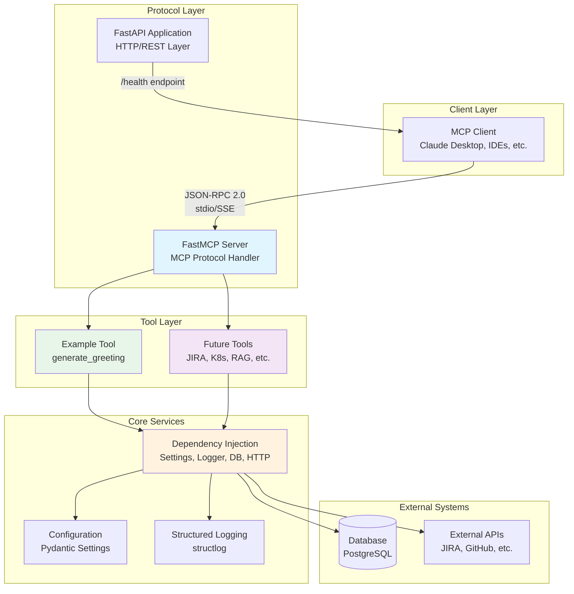

# Architecture Overview

**Last Updated**: 2025-10-15
**Version**: 1.0
**Status**: Active

## Purpose

This document provides a high-level overview of the AI Agent MCP Server architecture, explaining the system structure, key components, and how they interact. After reading this document, you should understand:

- The layered architecture and separation of concerns
- Key components and their responsibilities
- How MCP protocol integration works with FastAPI
- Where to find implementation details for each component

**Target Audience**: New team members, architects, and senior engineers evaluating the system design.

---

## System Architecture Diagram



### Diagram Legend

- **Protocol Layer (Blue)**: Handles MCP protocol communication and HTTP endpoints
- **Core Services (Orange)**: Shared infrastructure services accessed via dependency injection
- **Tool Layer (Green/Purple)**: MCP tool implementations (business logic)

---

## Component Overview

### 1. Client Layer

**MCP Clients** are applications that communicate with the MCP server to invoke tools. Examples include:
- Claude Desktop (Anthropic's official client)
- IDE extensions (VS Code, JetBrains)
- Custom automation scripts

**Communication Protocol**: MCP uses JSON-RPC 2.0 over stdio (standard input/output) or Server-Sent Events (SSE).

### 2. Protocol Layer

#### FastMCP Server

**Purpose**: Abstracts MCP protocol complexity from tool implementations.

**Responsibilities**:
- Handles MCP initialization handshake
- Manages bidirectional JSON-RPC 2.0 communication
- Exposes tools to clients with auto-generated JSON schemas
- Routes tool invocations to registered handlers

**Why FastMCP?** The official Anthropic MCP SDK provides high-level abstractions that handle protocol details while maintaining control over authentication and observability. See `src/mcp_server/main.py:49` for initialization.

**References**:
- Implementation: `src/mcp_server/main.py` (lines 45-50)
- Implementation Research: §2.4 - MCP SDK (FastMCP)

#### FastAPI Application

**Purpose**: Provides HTTP/REST interface for health checks and future REST endpoints.

**Responsibilities**:
- Health check endpoint (`/health`) for monitoring and load balancers
- Application lifecycle management (startup/shutdown)
- CORS middleware for development
- Auto-generated API documentation (`/docs`, `/redoc`)

**Why FastAPI?** Combines async performance, Pydantic integration, and developer-friendly features. See [design-decisions.md](design-decisions.md) for detailed rationale.

**References**:
- Implementation: `src/mcp_server/main.py` (lines 147-165)
- Implementation Research: §2.2 - FastAPI Framework

### 3. Core Services

#### Dependency Injection

**Purpose**: Provides tools with type-safe access to shared services (configuration, logging, database, HTTP client).

**Why Dependency Injection?**
- **Testability**: Tools can be tested with mocked dependencies
- **Flexibility**: Different configurations per environment (dev, staging, prod)
- **Explicitness**: No hidden global dependencies or magic imports
- **Type Safety**: Annotated types enable static type checking

**Key Services**:
- `get_settings()` - Application configuration (singleton)
- `get_logger()` - Structured logging with request context
- `get_db_session()` - Database session with automatic cleanup
- `get_http_client()` - Shared HTTP client with connection pooling

See [dependency-injection.md](dependency-injection.md) for detailed explanation and extension guide.

**References**:
- Implementation: `src/mcp_server/core/dependencies.py`
- Implementation Research: §4.2 - Dependency Injection Pattern

#### Configuration

**Purpose**: Centralized application configuration with validation.

**Technology**: Pydantic BaseSettings - type-safe configuration loaded from environment variables and `.env` file.

**Key Configuration**:
- Application metadata (name, version, description)
- Server settings (host, port, debug mode)
- Logging configuration (level, format)
- Database connection string
- External service credentials

**References**:
- Implementation: `src/mcp_server/config.py`
- Example: `.env.example`

#### Structured Logging

**Purpose**: Consistent, machine-readable logging for production observability.

**Technology**: structlog - provides JSON output for log aggregation systems (e.g., ELK, Datadog).

**Key Features**:
- Structured key-value logging (not unstructured strings)
- Contextual information (timestamp, log level, module name)
- JSON output for production, human-readable output for development
- Request-scoped context (can attach request ID, user ID, etc.)

**References**:
- Implementation: `src/mcp_server/main.py:52-94` (configure_logging)
- Configuration: `src/mcp_server/config.py` (log_level, log_format)

### 4. Tool Layer

**Purpose**: Implements MCP tools that agents can invoke to perform tasks.

**Current Tools**:
- `example.generate_greeting` - Demonstrates all key patterns (see US-011)

**Future Tools** (examples from product vision):
- JIRA integration (query issues, create tasks, update status)
- Kubernetes operations (query pod status, scale deployments)
- RAG query (search organizational knowledge bases)

**Tool Structure**: Each tool consists of:
1. **Input Model** (Pydantic) - Validates parameters from agent
2. **Output Model** (Pydantic) - Structures response data
3. **Business Logic Function** - Implements tool behavior with dependency injection
4. **MCP Tool Wrapper** - Registers function with `@mcp.tool` decorator

**References**:
- Example Implementation: `src/mcp_server/tools/example_tool.py`
- Extension Guide: [extension-guides/add-new-tool.md](extension-guides/add-new-tool.md)
- Implementation Research: §1.2 - Type Safety Across Agent-Tool Boundary

### 5. External Systems

#### Database (PostgreSQL)

**Purpose**: Persistent storage for application data (future: pgvector for RAG embeddings).

**Access Pattern**: Tools access database through dependency-injected `AsyncSession` with automatic connection pooling and cleanup.

**References**:
- Configuration: `src/mcp_server/config.py` (database_url)
- Dependency: `src/mcp_server/core/dependencies.py:99-138` (get_db_session)

#### External APIs

**Purpose**: Integration with third-party services (JIRA, GitHub, Kubernetes, etc.).

**Access Pattern**: Tools access HTTP APIs through shared `httpx.AsyncClient` with connection pooling.

**References**:
- Dependency: `src/mcp_server/core/dependencies.py:140-169` (get_http_client)

---

## Separation of Concerns

The architecture maintains clear boundaries between layers:

| Layer | Responsibility | Knows About | Doesn't Know About |
|-------|---------------|-------------|---------------------|
| **Client Layer** | User interaction, MCP communication | MCP protocol, available tools | Tool implementation details |
| **Protocol Layer** | Protocol handling, request routing | Tool schemas, dependency injection | Business logic, external APIs |
| **Core Services** | Infrastructure services | Configuration, logging setup | Tool implementations, MCP protocol |
| **Tool Layer** | Business logic, domain operations | Input/output schemas, dependencies | MCP protocol details, other tools |
| **External Systems** | Data persistence, third-party APIs | Own API contracts | MCP server internals |

**Key Principle**: Lower layers don't depend on higher layers. Tools depend on core services, but core services don't depend on tools.

---

## Request Flow

For detailed request flow and sequence diagrams, see [request-flow.md](request-flow.md).

**High-Level Flow**:
1. Client sends MCP tool invocation (JSON-RPC 2.0)
2. FastMCP deserializes request and validates against tool schema
3. FastMCP routes to registered tool handler function
4. Tool accesses dependencies (config, logger, DB, HTTP client)
5. Tool executes business logic
6. Tool returns Pydantic output model
7. FastMCP serializes response to JSON-RPC 2.0
8. Client receives response

---

## Directory Structure

```
src/mcp_server/
├── main.py                      # Application entry point, FastAPI + FastMCP setup
├── config.py                    # Pydantic configuration model
├── core/
│   ├── constants.py             # Application constants
│   ├── dependencies.py          # Dependency injection providers
│   └── exceptions.py            # Custom exception classes
└── tools/
    ├── example_tool.py          # Example MCP tool (US-011)
    └── [future tools]           # JIRA, K8s, RAG tools

tests/
├── conftest.py                  # Shared pytest fixtures
├── unit/                        # Unit tests (mocked dependencies)
└── integration/                 # Integration tests (real dependencies)

docs/
├── architecture/                # This directory
└── [future docs]                # API docs, runbooks, etc.
```

**Design Rationale**: Follows standard Python `src/` layout with clear separation between core framework code (`core/`) and tool implementations (`tools/`). See Implementation Research §4.1 for detailed structure patterns.

---

## Technology Stack Summary

| Component | Technology | Version | Purpose |
|-----------|-----------|---------|---------|
| **Web Framework** | FastAPI | 0.100+ | HTTP/REST layer, async support |
| **MCP SDK** | FastMCP (Anthropic) | Latest | MCP protocol handling |
| **Validation** | Pydantic | 2.x | Input/output validation, configuration |
| **Logging** | structlog | Latest | Structured logging |
| **Database** | PostgreSQL | 15+ | Persistent storage (with pgvector for RAG) |
| **Database ORM** | SQLAlchemy | 2.x async | Database access |
| **HTTP Client** | httpx | Latest | External API calls |
| **Testing** | pytest + pytest-asyncio | Latest | Unit and integration testing |
| **Type Checking** | mypy | Latest | Static type analysis |
| **Linting** | Ruff | Latest | Fast Python linter |

For detailed technology rationale, see [design-decisions.md](design-decisions.md).

---

## Key Architectural Decisions

The following key decisions shaped the architecture. See [design-decisions.md](design-decisions.md) for detailed rationale.

1. **FastAPI + FastMCP**: Combines async performance with MCP protocol abstraction
2. **Pydantic-First Architecture**: Type safety across all boundaries (API, tools, configuration)
3. **Explicit Dependency Injection**: Testable, flexible, no hidden dependencies
4. **Structured Logging**: Machine-readable logs for production observability
5. **Async/Await Throughout**: Consistency and performance for I/O-bound workloads
6. **Separation of Tool Registration and Business Logic**: Testing and reusability

---

## Extension Points

The architecture is designed for extension. Common scenarios:

- **Add New MCP Tool**: See [extension-guides/add-new-tool.md](extension-guides/add-new-tool.md)
- **Add Database Access**: See [extension-guides/add-database-access.md](extension-guides/add-database-access.md)
- **Add External Service Integration**: See [extension-guides/add-external-service.md](extension-guides/add-external-service.md)

---

## Related Documentation

- **Dependency Injection**: [dependency-injection.md](dependency-injection.md) - Deep dive on DI patterns
- **Request Flow**: [request-flow.md](request-flow.md) - Detailed request lifecycle
- **Design Decisions**: [design-decisions.md](design-decisions.md) - Technology rationale
- **Extension Guides**: [extension-guides/](extension-guides/) - How-to guides

### CLAUDE.md Implementation Standards

Architecture documentation provides system context. For implementation details, see:

- **CLAUDE-architecture.md**: Project structure, modularity patterns
- **CLAUDE-typing.md**: Type hints, annotations, type safety
- **CLAUDE-validation.md**: Input validation, security
- **CLAUDE-testing.md**: Testing strategy, fixtures
- **CLAUDE-tooling.md**: Development commands (Taskfile)

**Rule of Thumb**: Read architecture docs for WHY (design rationale), read CLAUDE.md for HOW (implementation standards).

---

## Changelog

- **2025-10-15** (v1.0): Initial architecture documentation (US-013)
