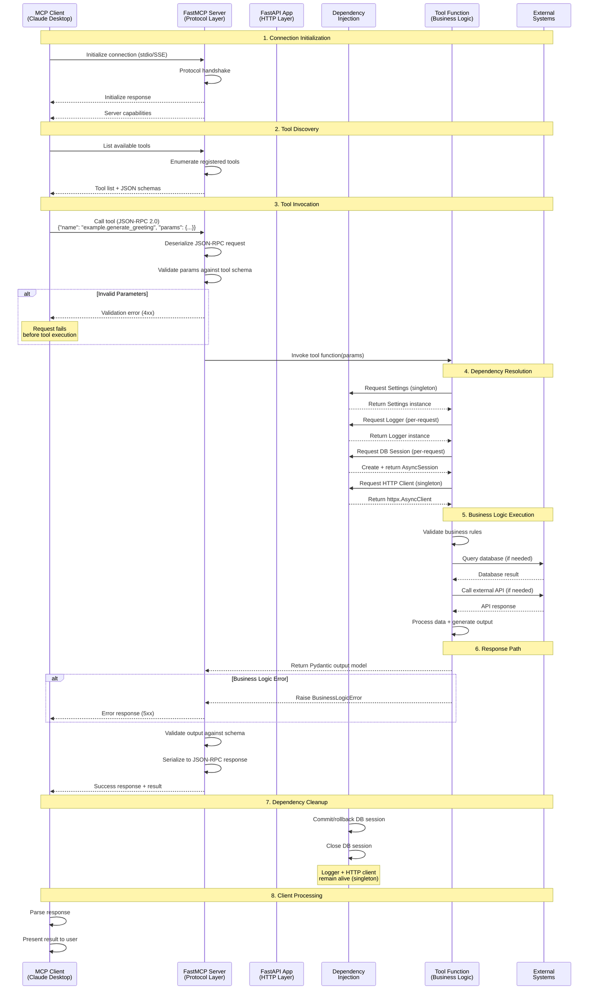
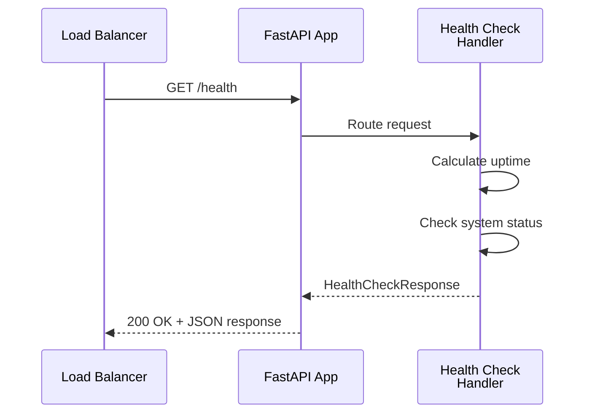
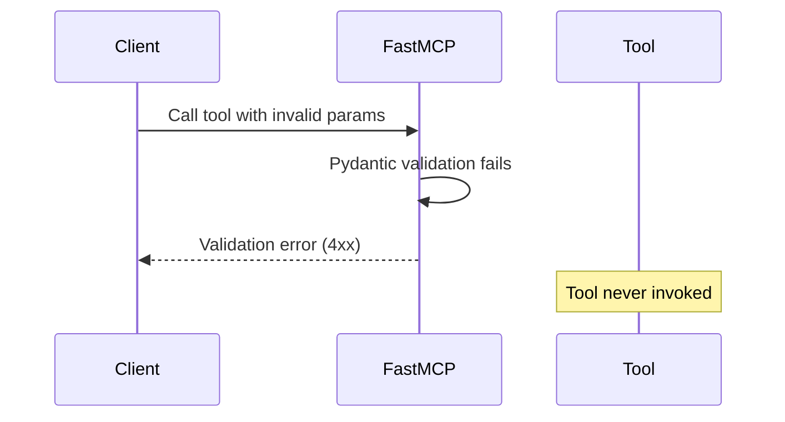
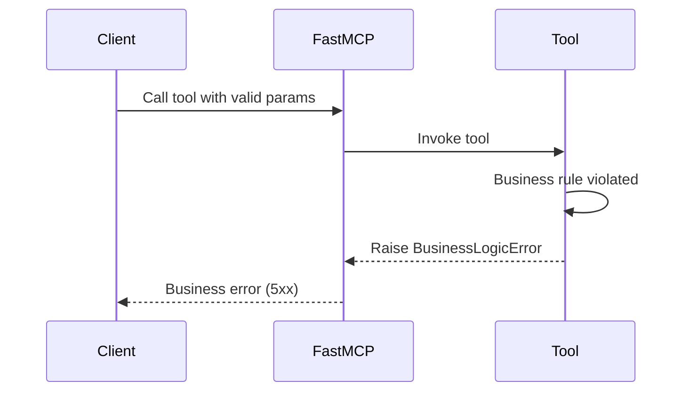
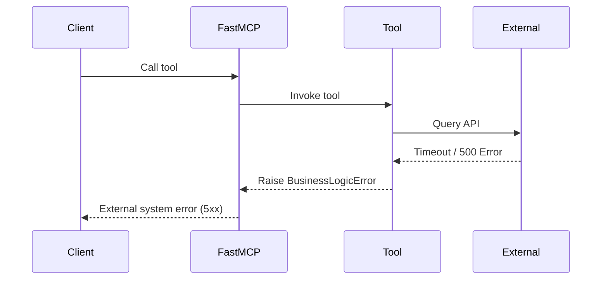

# Request Flow and Lifecycle

**Last Updated**: 2025-10-15
**Version**: 1.0
**Status**: Active

## Purpose

This document explains the complete lifecycle of an MCP tool invocation, from client request to server response. Understanding this flow is essential for debugging issues and implementing new tools correctly.

**After reading this document, you should be able to**:
- Trace an MCP request through all system layers
- Identify integration points and potential failure modes
- Debug tool invocation issues using the request flow
- Understand protocol-level details (JSON-RPC 2.0, MCP handshake)

**Target Audience**: Engineers debugging issues, implementing tools, or integrating MCP clients.

---

## Complete Request Flow Sequence Diagram



---

## Detailed Phase Breakdown

### Phase 1: Connection Initialization

**What Happens**: MCP client establishes connection with server and performs protocol handshake.

**Protocol**: JSON-RPC 2.0 over stdio (standard input/output) or Server-Sent Events (SSE).

**MCP Handshake Steps**:
1. Client sends `initialize` request with client capabilities
2. Server responds with server capabilities (supported protocol version, available features)
3. Client sends `initialized` notification confirming handshake
4. Connection ready for tool invocations

**Implementation**: FastMCP SDK handles handshake automatically. See `src/mcp_server/main.py:49` for FastMCP initialization.

**Failure Modes**:
- Protocol version mismatch (client requires newer protocol than server supports)
- Transport failure (stdio pipe broken, SSE connection dropped)

**Debugging**:
```bash
# View FastMCP initialization logs
tail -f logs/mcp_server.log | grep "initialize"
```

---

### Phase 2: Tool Discovery

**What Happens**: Client requests list of available tools with their schemas.

**Request**:
```json
{
  "jsonrpc": "2.0",
  "method": "tools/list",
  "id": 1
}
```

**Response**:
```json
{
  "jsonrpc": "2.0",
  "result": {
    "tools": [
      {
        "name": "example.generate_greeting",
        "description": "Generates a personalized greeting message...",
        "inputSchema": {
          "type": "object",
          "properties": {
            "name": {"type": "string", "minLength": 1, "maxLength": 100},
            "style": {"type": "string", "enum": ["formal", "casual", "enthusiastic"]}
          },
          "required": ["name"]
        }
      }
    ]
  },
  "id": 1
}
```

**Key Insight**: FastMCP auto-generates JSON schemas from Pydantic models. You don't write schemas manually.

**Implementation**: Tools registered with `@mcp.tool()` decorator. See `src/mcp_server/main.py:172-227` for example tool registration.

**Failure Modes**:
- Tool not registered (missing `@mcp.tool()` decorator)
- Invalid Pydantic schema (FastMCP can't serialize to JSON schema)

---

### Phase 3: Tool Invocation

**What Happens**: Client sends tool invocation request with parameters.

**Request**:
```json
{
  "jsonrpc": "2.0",
  "method": "tools/call",
  "params": {
    "name": "example.generate_greeting",
    "arguments": {
      "name": "Alice",
      "style": "formal"
    }
  },
  "id": 2
}
```

**Validation Steps**:
1. FastMCP deserializes JSON-RPC request
2. FastMCP validates `arguments` against tool's input schema (Pydantic model)
3. If validation fails → Return error response (validation errors)
4. If validation passes → Invoke tool function with validated params

**Implementation**: FastMCP handles deserialization and validation. Tool receives validated Pydantic model.

**Failure Modes**:
- **Missing required field**: `{"error": "Field 'name' is required"}`
- **Invalid type**: `{"error": "Field 'name' must be string, got int"}`
- **Failed constraint**: `{"error": "Field 'name' must be 1-100 characters"}`
- **Custom validator failure**: `{"error": "Name must contain only letters, spaces, hyphens"}`

**Debugging**:
```python
# Tool receives fully validated input
async def my_tool(params: MyInput) -> MyOutput:
    # params is guaranteed to match MyInput schema
    # No manual validation needed
    ...
```

---

### Phase 4: Dependency Resolution

**What Happens**: Tool accesses shared services through dependency injection.

**Dependency Access Pattern** (FastMCP tools):
```python
@mcp.tool(name="example.tool")
async def my_tool(params: MyInput) -> MyOutput:
    # Access dependencies directly (not as function parameters)
    from mcp_server.config import settings
    from mcp_server.core.dependencies import get_logger, get_http_client

    logger = get_logger("mcp_server.tools.my_tool")
    client = get_http_client()

    logger.info(f"Tool invoked in {settings.environment}")
    # ... use dependencies ...
```

**Dependency Lifecycles**:
- **Settings**: Singleton (same instance for all requests)
- **Logger**: Per-request (new logger instance, or reused if name matches)
- **DB Session**: Per-request (new session, auto-cleanup after request)
- **HTTP Client**: Singleton (shared connection pool)

**Implementation**: See `src/mcp_server/core/dependencies.py` for all dependency providers.

**Failure Modes**:
- Dependency not initialized (HTTP client/DB not set up during app startup)
- Configuration error (invalid database URL, missing API key)

See [dependency-injection.md](dependency-injection.md) for detailed DI documentation.

---

### Phase 5: Business Logic Execution

**What Happens**: Tool implements domain-specific logic using dependencies.

**Example Flow** (from `src/mcp_server/tools/example_tool.py`):
```python
async def generate_greeting(
    params: GreetingInput,
    settings: Settings,
    logger: logging.Logger,
) -> GreetingOutput:
    # 1. Log tool invocation
    logger.info(f"Generating greeting: name={params.name}, style={params.style}")

    # 2. Apply business logic
    if params.style == GreetingStyle.FORMAL:
        greeting_prefix = "Good day"
    elif params.style == GreetingStyle.CASUAL:
        greeting_prefix = "Hey"
    else:
        greeting_prefix = "Hello there"

    greeting = f"{greeting_prefix}, {params.name}!"

    # 3. Validate business rules
    if len(greeting) > 600:
        raise BusinessLogicError("Greeting exceeds maximum length")

    # 4. Return structured output
    return GreetingOutput(
        greeting=greeting,
        style_used=params.style.value,
        character_count=len(greeting),
        metadata={
            "app_name": settings.app_name,
            "app_version": settings.app_version,
        }
    )
```

**Key Patterns**:
- **Structured logging**: Log with context (tool name, params)
- **Business rule validation**: Raise `BusinessLogicError` for rule violations
- **Typed output**: Return Pydantic model (auto-validated)

**Failure Modes**:
- **Business logic error**: Raised as `BusinessLogicError` with details
- **Database error**: Connection failure, query timeout, constraint violation
- **External API error**: Timeout, rate limit, authentication failure
- **Unexpected exception**: Wrapped in `BusinessLogicError`

**Error Handling Pattern**:
```python
try:
    # Business logic
    result = compute_result(params)
    return result
except BusinessLogicError:
    # Re-raise business errors as-is
    logger.error(f"Business logic error: {params}")
    raise
except Exception as e:
    # Wrap unexpected errors
    logger.exception(f"Unexpected error: {e}")
    raise BusinessLogicError("Failed due to unexpected error", details={"error": str(e)}) from e
```

See `src/mcp_server/core/exceptions.py` for custom exception classes.

---

### Phase 6: Response Path

**What Happens**: Tool returns result, FastMCP serializes to JSON-RPC response.

**Success Response**:
```json
{
  "jsonrpc": "2.0",
  "result": {
    "greeting": "Good day, Alice!",
    "style_used": "formal",
    "character_count": 17,
    "metadata": {
      "app_name": "AI Agent MCP Server",
      "app_version": "0.1.0"
    }
  },
  "id": 2
}
```

**Error Response** (Business Logic Error):
```json
{
  "jsonrpc": "2.0",
  "error": {
    "code": -32000,
    "message": "Greeting exceeds maximum length of 600 characters",
    "data": {
      "greeting_length": "650",
      "max_length": "600",
      "name": "Alice"
    }
  },
  "id": 2
}
```

**Validation Steps**:
1. Tool returns Pydantic `GreetingOutput` model
2. Pydantic validates output matches schema (catches bugs in tool implementation)
3. FastMCP serializes output to JSON
4. FastMCP wraps in JSON-RPC 2.0 response envelope

**Key Insight**: Output validation catches tool implementation bugs before client receives response.

---

### Phase 7: Dependency Cleanup

**What Happens**: Request-scoped dependencies automatically cleaned up.

**Cleanup Actions**:
- **Database Session**: Commits transaction (if no errors) or rolls back (if error raised), then closes session
- **HTTP Client**: No cleanup (singleton, remains alive)
- **Logger**: No cleanup (lightweight, recreated per request)
- **Settings**: No cleanup (singleton)

**Implementation**: FastAPI's dependency injection system handles cleanup automatically using context managers.

**DB Session Lifecycle**:
```python
async def get_db_session() -> AsyncGenerator[AsyncSession, None]:
    async with _session_maker() as session:
        try:
            yield session       # Tool uses session
            await session.commit()  # Auto-commit on success
        except Exception:
            await session.rollback()  # Auto-rollback on error
            raise
        # Session closed automatically by context manager
```

**Manual Cleanup Not Required**: Don't manually commit/rollback/close dependencies. DI system handles it.

---

### Phase 8: Client Processing

**What Happens**: Client receives response and presents result to user.

**Client Responsibilities**:
- Parse JSON-RPC response
- Extract result or error
- Handle errors gracefully (display to user, retry, fallback)
- Present result to user (text, UI, further processing)

**Example** (Claude Desktop):
- User asks: "Generate a formal greeting for Alice"
- Claude invokes: `example.generate_greeting(name="Alice", style="formal")`
- Server responds: `{"greeting": "Good day, Alice!", ...}`
- Claude presents: "Here's a formal greeting: Good day, Alice!"

---

## Alternative Flow: Health Check (HTTP Endpoint)

The server also exposes a standard HTTP health check endpoint for monitoring.

### Health Check Request Flow



**Request**:
```bash
curl http://localhost:8000/health
```

**Response**:
```json
{
  "status": "healthy",
  "version": "0.1.0",
  "uptime_seconds": 3600.5,
  "timestamp": "2025-10-15T10:30:00.000Z"
}
```

**Use Cases**:
- Load balancer health checks
- Kubernetes liveness/readiness probes
- Monitoring system status checks
- Uptime tracking

**Implementation**: See `src/mcp_server/main.py:244-268` for health check endpoint.

---

## Error Handling Flow

### Validation Error (Phase 3)



**Example**: Missing required field
```json
{
  "jsonrpc": "2.0",
  "error": {
    "code": -32602,
    "message": "Invalid params",
    "data": {
      "errors": [
        {"field": "name", "message": "Field required"}
      ]
    }
  },
  "id": 2
}
```

### Business Logic Error (Phase 5)



**Example**: Business rule violation
```json
{
  "jsonrpc": "2.0",
  "error": {
    "code": -32000,
    "message": "Greeting exceeds maximum length",
    "data": {
      "greeting_length": "650",
      "max_length": "600"
    }
  },
  "id": 2
}
```

### External System Error (Phase 5)



**Error Classification**:
- **4xx errors**: Client error (invalid input, validation failure) → Client should fix input
- **5xx errors**: Server error (business logic, external system failure) → Server-side investigation needed

---

## Performance Considerations

### Connection Pooling

**Database**: SQLAlchemy connection pool (10 permanent + 20 overflow connections)
```python
engine = create_async_engine(
    database_url,
    pool_size=10,        # Permanent connections
    max_overflow=20,     # Additional when pool exhausted
)
```

**HTTP Client**: httpx connection pool (10 keepalive + 20 total connections)
```python
_http_client = httpx.AsyncClient(
    limits=httpx.Limits(
        max_keepalive_connections=10,
        max_connections=20,
    ),
)
```

**Impact**: Connection reuse reduces latency (no handshake overhead per request).

### Async/Await Throughout

All I/O operations use async/await:
- Database queries: `await session.execute(query)`
- HTTP requests: `await client.get(url)`
- Tool functions: `async def my_tool(...)`

**Impact**: High concurrency (handle 1000+ concurrent requests on single thread).

### Request-Scoped Cleanup

Database sessions auto-cleanup prevents connection leaks:
```python
# No manual cleanup required
async def my_tool(session: SessionDep):
    await session.execute(query)
    # Session auto-closed after tool returns
```

---

## Debugging Checklist

When tool invocation fails, check these points in order:

### 1. Connection Issues
- [ ] Client successfully connected to server (check `initialize` handshake)
- [ ] Protocol version compatibility (client/server MCP version match)
- [ ] Transport working (stdio pipe, SSE connection alive)

### 2. Tool Discovery Issues
- [ ] Tool registered with `@mcp.tool()` decorator
- [ ] Tool appears in `tools/list` response
- [ ] JSON schema generated correctly from Pydantic model

### 3. Validation Issues
- [ ] Input parameters match tool schema (required fields present)
- [ ] Parameter types correct (string not int, enum value valid)
- [ ] Custom validators pass (regex pattern, business constraints)

### 4. Dependency Issues
- [ ] Dependencies initialized during app startup
- [ ] Configuration valid (database URL, API keys present)
- [ ] Connection pooling working (no "connection refused" errors)

### 5. Business Logic Issues
- [ ] Business rules implemented correctly
- [ ] Error handling covers all failure cases
- [ ] External API calls handle timeouts/retries

### 6. Response Issues
- [ ] Output model matches schema (all required fields present)
- [ ] Output serializable to JSON (no datetime, no custom objects without serializers)

---

## Related Documentation

- **Architecture Overview**: [overview.md](overview.md) - System component overview
- **Dependency Injection**: [dependency-injection.md](dependency-injection.md) - DI deep dive
- **Design Decisions**: [design-decisions.md](design-decisions.md) - Technology rationale
- **Extension Guides**: [extension-guides/add-new-tool.md](extension-guides/add-new-tool.md) - Implement new tools

### CLAUDE.md Standards

- **CLAUDE-testing.md**: Testing request flows, mocking dependencies
- **CLAUDE-tooling.md**: Development commands for running server

---

## Changelog

- **2025-10-15** (v1.0): Initial request flow documentation (US-013)
