# MCP Tools Sequence Diagram - Detailed Communication Flow

**Purpose:** Comprehensive sequence diagram showing request/response flow between AI Agent (Claude Code), MCP Server Tools, and backend microservices.

**Version:** 2.0
**Date:** 2025-10-19
**Based On:**
- US-040 through US-047 (MCP Tools - Validation and Path Resolution)
- US-050 (Task Tracking REST API Implementation)
- US-051 (ID Management REST API Implementation)

---

## Overview

This document provides detailed sequence diagrams for all MCP tools showing:
- Request parameters
- Response structures
- Error handling paths
- Backend microservice interactions
- Database operations (for Task Tracking and ID Registry)

---

## Tool 1: validate_artifact

### Purpose
Validates generated artifacts against structured validation checklists with deterministic criteria evaluation.

### Participants
- **Claude Code** (AI Agent)
- **MCP Server** (FastMCP Tool)
- **Validation Resources** (JSON checklists on filesystem)
- **ChecklistCache** (In-memory cache, TTL: 5 minutes)

### Request Flow

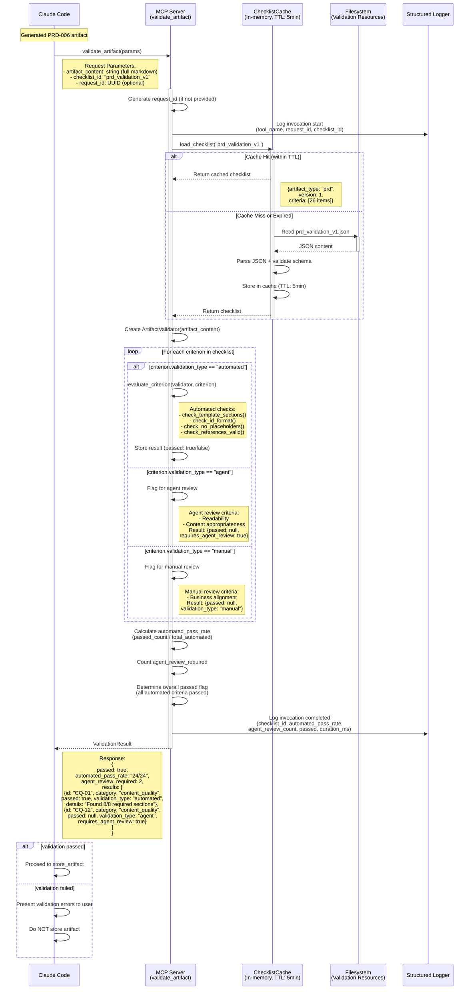

### Error Scenarios

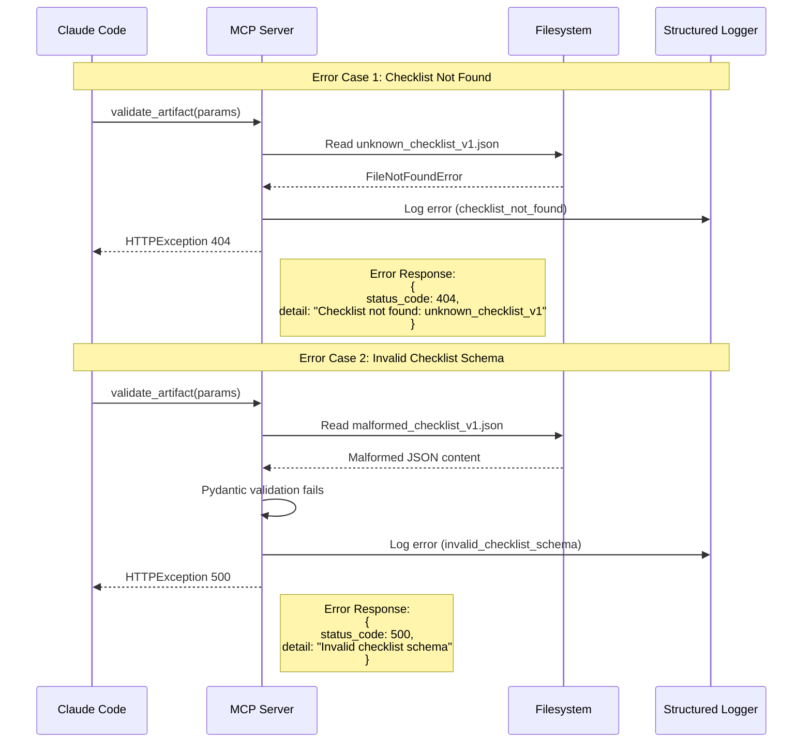

---

## Tool 2: resolve_artifact_path

### Purpose
Resolves artifact identifiers (type, ID, version) to MCP resource URIs for accessing artifacts.

### Participants
- **Claude Code** (AI Agent)
- **MCP Server** (FastMCP Tool)
- **ArtifactResolver** (Path resolution logic)
- **Filesystem** (Artifacts directory)

### Request Flow

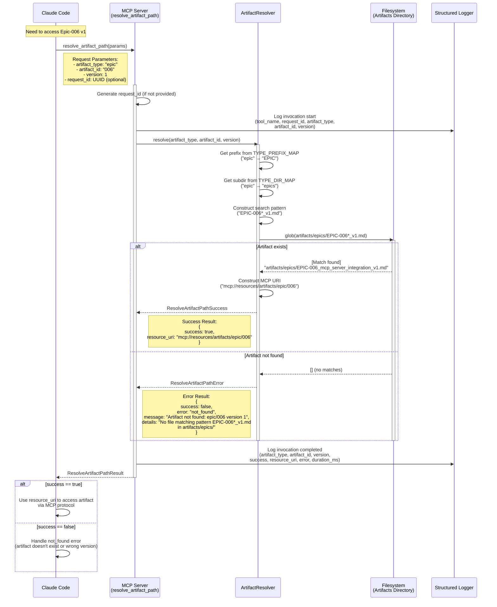

### Error Scenarios

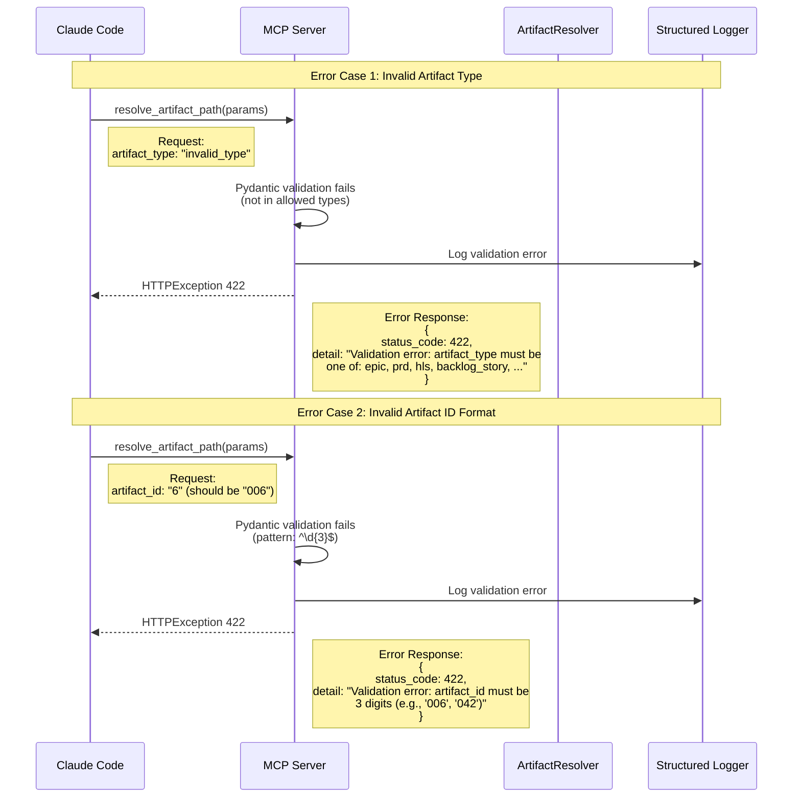

---

## Tool 3: store_artifact

### Purpose
Stores generated artifacts to centralized storage with metadata extraction and atomic writes.

### Participants
- **Claude Code** (AI Agent)
- **MCP Server** (FastMCP Tool)
- **MetadataExtractor** (Parses artifact markdown)
- **ArtifactStorageManager** (Storage logic)
- **Filesystem** (Centralized storage directory)

### Request Flow

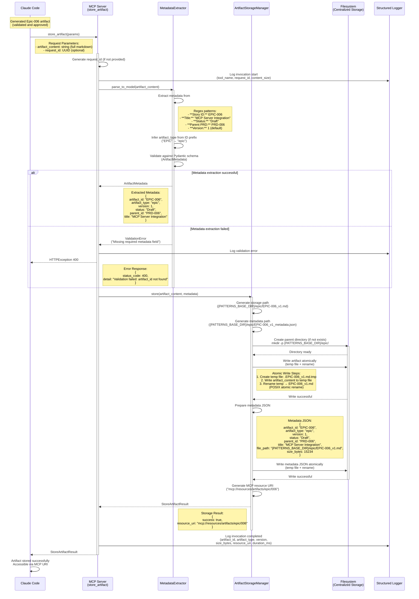

### Error Scenarios

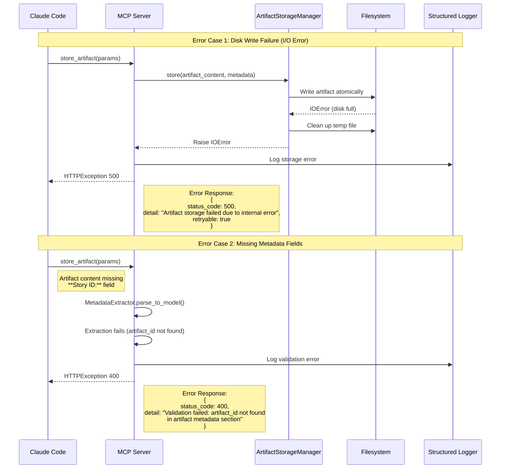

---

## Tool 4: add_task

### Purpose
Adds tasks to Task Tracking microservice queue after artifact generation for automatic sub-artifact workflow initiation.

### Participants
- **Claude Code** (AI Agent)
- **MCP Server** (FastMCP Tool)
- **TaskTrackingClient** (HTTP client with retry logic)
- **Task Tracking Microservice** (REST API)
- **PostgreSQL Database** (Task persistence)

### Request Flow

```mermaid
sequenceDiagram
    participant CC as Claude Code
    participant MCP as MCP Server<br/>(add_task)
    participant Client as TaskTrackingClient<br/>(HTTP Client + Retry)
    participant API as Task Tracking<br/>Microservice<br/>(REST API)
    participant DB as PostgreSQL<br/>(tasks table)
    participant Log as Structured Logger

    Note over CC: PRD-006 generated and validated<br/>Requires 6 HLS decompositions

    CC->>MCP: add_task(params)
    Note right of CC: Request Parameters:<br/>tasks: [<br/>  {artifact_id: "HLS-006", artifact_type: "hls",<br/>   generator: "hls-generator", parent_id: "PRD-006",<br/>   status: "pending", description: "Generate HLS-006 from PRD-006"},<br/>  {artifact_id: "HLS-007", ...},<br/>  {artifact_id: "HLS-008", ...},<br/>  {artifact_id: "HLS-009", ...},<br/>  {artifact_id: "HLS-010", ...},<br/>  {artifact_id: "HLS-011", ...}<br/>]<br/>request_id: UUID (optional)

    activate MCP
    MCP->>MCP: Generate request_id (if not provided)
    MCP->>Log: Log invocation start<br/>(tool_name, request_id, tasks_count)

    MCP->>MCP: Validate task metadata (Pydantic)
    Note right of MCP: Validation checks:<br/>- artifact_id format (HLS-\d{3})<br/>- artifact_type matches ID prefix<br/>- generator name valid<br/>- parent_id format valid<br/>- status in allowed values

    alt Validation failed
        MCP->>Log: Log validation error
        MCP-->>CC: HTTPException 400
        Note right of MCP: Error Response:<br/>{<br/>  status_code: 400,<br/>  detail: "Artifact ID 'EPIC-006' does not match<br/>          type 'hls' (expected prefix: HLS)"<br/>}
    end

    MCP->>MCP: Auto-generate descriptions (if not provided)<br/>("Generate {artifact_id} from {parent_id}")

    MCP->>Client: add_tasks_batch(tasks)
    activate Client

    Client->>Client: Prepare API request payload
    Note right of Client: Request Payload:<br/>{<br/>  project_id: "ai-agent-mcp-server",<br/>  tasks: [<br/>    {artifact_id: "HLS-006", artifact_type: "hls",<br/>     generator: "hls-generator", parent_id: "PRD-006",<br/>     status: "pending",<br/>     description: "Generate HLS-006 from PRD-006",<br/>     inputs: ["PRD-006"],<br/>     expected_outputs: ["HLS-006"]},<br/>    ...<br/>  ]<br/>}

    Client->>API: POST /tasks/batch<br/>(with retry logic: 3 attempts, exponential backoff)
    activate API

    alt Success (201 Created)
        API->>DB: BEGIN TRANSACTION
        activate DB

        loop For each task in batch
            API->>DB: INSERT INTO tasks<br/>(artifact_id, artifact_type, generator,<br/>parent_id, status, description, inputs,<br/>expected_outputs, created_at)
            DB-->>API: Task inserted (task_id generated)
        end

        API->>DB: COMMIT TRANSACTION
        DB-->>API: Transaction committed
        deactivate DB

        API-->>Client: Response 201 Created
        Note left of API: Success Response:<br/>{<br/>  success: true,<br/>  tasks_added: 6,<br/>  task_ids: ["TASK-051", "TASK-052", "TASK-053",<br/>            "TASK-054", "TASK-055", "TASK-056"]<br/>}

    else Validation Error (400 Bad Request)
        API->>API: Validate request payload
        API->>API: Validation fails<br/>(duplicate artifact_id, invalid format, etc.)
        API-->>Client: Response 400 Bad Request
        Note left of API: Error Response:<br/>{<br/>  status_code: 400,<br/>  detail: "Task validation failed: artifact_id<br/>          HLS-006 already exists in queue"<br/>}
        Client->>Log: Log validation error (no retry)
        Client-->>MCP: Raise ValueError

    else Auth Error (401 Unauthorized)
        API->>API: Validate API key
        API->>API: API key invalid
        API-->>Client: Response 401 Unauthorized
        Note left of API: Error Response:<br/>{<br/>  status_code: 401,<br/>  detail: "Invalid API key"<br/>}
        Client->>Log: Log auth error (no retry)
        Client-->>MCP: Raise PermissionError

    else Server Error (503 Service Unavailable)
        API-->>Client: Response 503 Service Unavailable
        Note left of API: Transient failure<br/>(database connection lost)

        Client->>Client: Wait 100ms (exponential backoff)
        Client->>API: POST /tasks/batch (Retry 1)
        API-->>Client: Response 503 Service Unavailable

        Client->>Client: Wait 200ms (exponential backoff)
        Client->>API: POST /tasks/batch (Retry 2)
        API-->>Client: Response 503 Service Unavailable

        Client->>Client: Wait 400ms (exponential backoff)
        Client->>API: POST /tasks/batch (Retry 3)
        API->>DB: Transaction succeeds
        activate DB
        DB-->>API: Tasks inserted
        deactivate DB
        API-->>Client: Response 201 Created

        Note over Client: Total duration: ~700ms<br/>(within <500ms p95 target for most requests)
    end
    deactivate API

    Client-->>MCP: API response
    deactivate Client

    MCP->>MCP: Extract task_ids and artifact_ids

    MCP->>Log: Log invocation completed<br/>(tasks_added, artifact_ids, generators,<br/>task_ids, duration_ms)

    MCP-->>CC: AddTaskResult
    deactivate MCP
    Note left of MCP: Response:<br/>{<br/>  success: true,<br/>  tasks_added: 6,<br/>  task_ids: ["TASK-051", "TASK-052", "TASK-053",<br/>            "TASK-054", "TASK-055", "TASK-056"],<br/>  artifact_ids: ["HLS-006", "HLS-007", "HLS-008",<br/>                "HLS-009", "HLS-010", "HLS-011"]<br/>}

    CC->>CC: Tasks added to queue<br/>Next get_next_task() will return HLS-006
```

### Retry Logic Detail

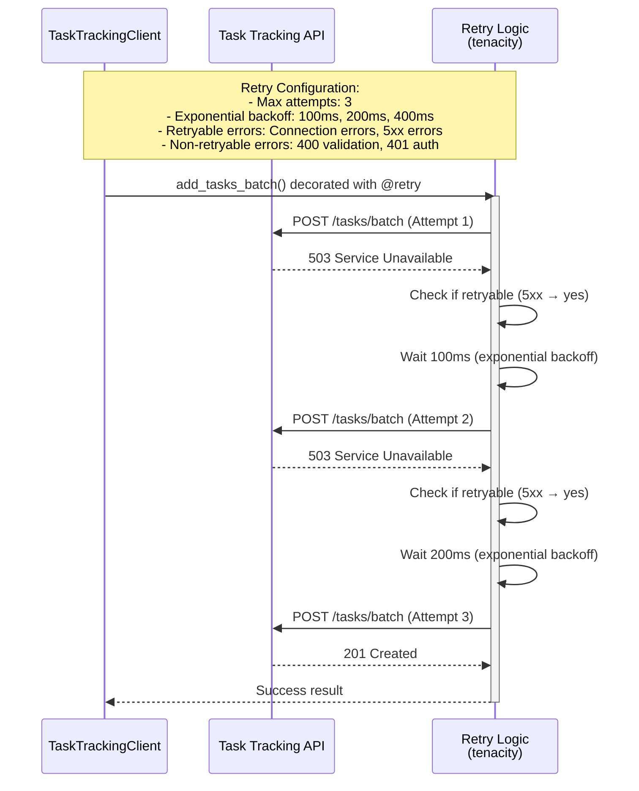

---

## End-to-End Workflow: Generate PRD → Validate → Store → Add HLS Tasks

### Complete Workflow with All Tools

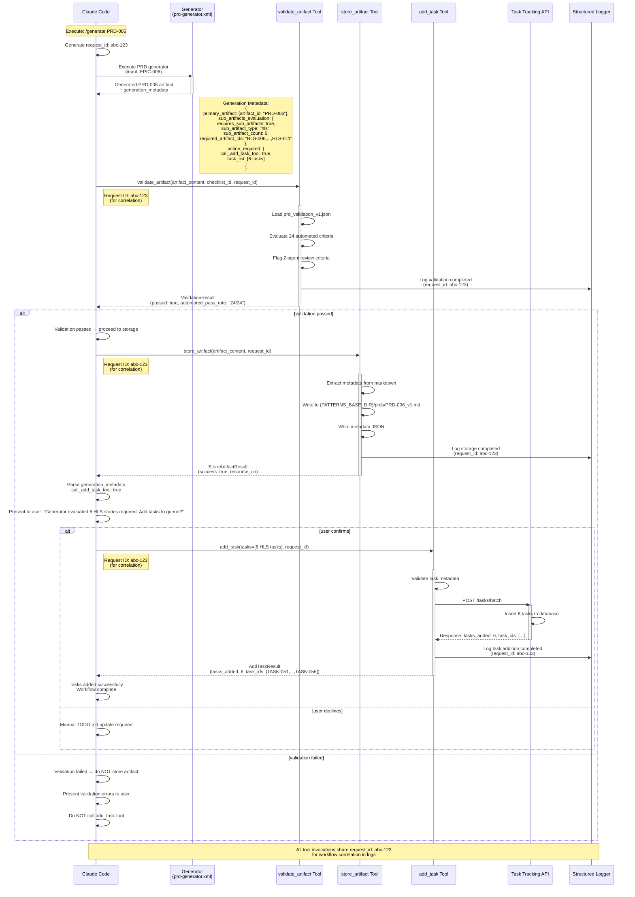

---

## Logging and Observability

### Structured Log Output (JSON)

All tool invocations produce structured JSON logs with standard fields:

#### Example: validate_artifact Log Entry

```json
{
  "timestamp": "2025-10-19T14:30:00.123Z",
  "event": "validate_artifact_invocation_completed",
  "tool_name": "validate_artifact",
  "request_id": "abc-123-def-456",
  "checklist_id": "prd_validation_v1",
  "artifact_type": "prd",
  "automated_pass_rate": "24/24",
  "agent_review_count": 2,
  "success": true,
  "duration_ms": 234
}
```

#### Example: add_task Log Entry

```json
{
  "timestamp": "2025-10-19T14:30:05.789Z",
  "event": "add_task_invocation_completed",
  "tool_name": "add_task",
  "request_id": "abc-123-def-456",
  "tasks_added": 6,
  "artifact_ids": ["HLS-006", "HLS-007", "HLS-008", "HLS-009", "HLS-010", "HLS-011"],
  "generators": ["hls-generator", "hls-generator", "hls-generator", "hls-generator", "hls-generator", "hls-generator"],
  "task_ids": ["TASK-051", "TASK-052", "TASK-053", "TASK-054", "TASK-055", "TASK-056"],
  "success": true,
  "duration_ms": 342
}
```

#### Example: Error Log Entry

```json
{
  "timestamp": "2025-10-19T14:35:12.456Z",
  "event": "resolve_artifact_path_invocation_failed",
  "tool_name": "resolve_artifact_path",
  "request_id": "xyz-789-abc-012",
  "artifact_type": "epic",
  "artifact_id": "999",
  "version": 1,
  "success": false,
  "error": "not_found",
  "error_message": "Artifact not found: epic/999 version 1",
  "duration_ms": 45
}
```

---

## Database Schema (Task Tracking Microservice)

### Tasks Table

```sql
CREATE TABLE tasks (
    task_id VARCHAR(20) PRIMARY KEY,           -- TASK-051, TASK-052, etc.
    project_id VARCHAR(100) NOT NULL,          -- ai-agent-mcp-server
    artifact_id VARCHAR(20) NOT NULL,          -- HLS-006, US-040, etc.
    artifact_type VARCHAR(50) NOT NULL,        -- hls, backlog_story, etc.
    generator VARCHAR(100) NOT NULL,           -- hls-generator, backlog-story-generator
    parent_id VARCHAR(20),                     -- PRD-006, HLS-006, etc.
    status VARCHAR(20) NOT NULL,               -- pending, in_progress, completed
    description TEXT,                          -- "Generate HLS-006 from PRD-006"
    inputs TEXT[],                             -- ["PRD-006"]
    expected_outputs TEXT[],                   -- ["HLS-006"]
    created_at TIMESTAMP DEFAULT NOW(),
    updated_at TIMESTAMP DEFAULT NOW(),
    started_at TIMESTAMP,
    completed_at TIMESTAMP,

    INDEX idx_status (status),
    INDEX idx_project_artifact (project_id, artifact_id),
    INDEX idx_parent_id (parent_id)
);
```

### Example Task Records

```sql
-- After add_task tool executes (6 HLS tasks added)

INSERT INTO tasks VALUES
('TASK-051', 'ai-agent-mcp-server', 'HLS-006', 'hls', 'hls-generator', 'PRD-006', 'pending',
 'Generate HLS-006 from PRD-006', ARRAY['PRD-006'], ARRAY['HLS-006'], '2025-10-19 14:30:05', ...),

('TASK-052', 'ai-agent-mcp-server', 'HLS-007', 'hls', 'hls-generator', 'PRD-006', 'pending',
 'Generate HLS-007 from PRD-006', ARRAY['PRD-006'], ARRAY['HLS-007'], '2025-10-19 14:30:05', ...),

-- ... (4 more HLS tasks)
```

---

## Tool 5: get_next_available_id

### Purpose
Retrieves next available artifact ID from ID Management microservice for globally unique ID allocation.

### Participants
- **Claude Code** (AI Agent)
- **MCP Server** (FastMCP Tool)
- **ID Management Microservice** (Go REST API)
- **PostgreSQL Database** (id_registry table)

### Request Flow

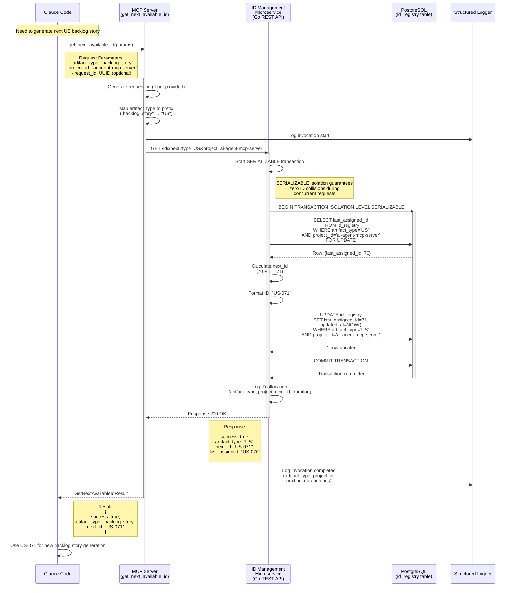

### Concurrent Request Safety

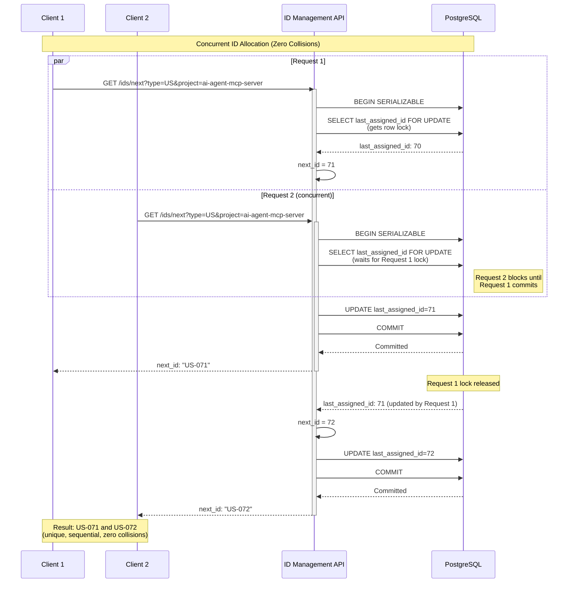

---

## Tool 6: reserve_id_range

### Purpose
Reserves contiguous ID range for batch artifact generation (e.g., 6 HLS stories) with 15-minute expiration.

### Participants
- **Claude Code** (AI Agent)
- **MCP Server** (FastMCP Tool)
- **ID Management Microservice** (Go REST API)
- **PostgreSQL Database** (id_registry and id_reservations tables)

### Request Flow

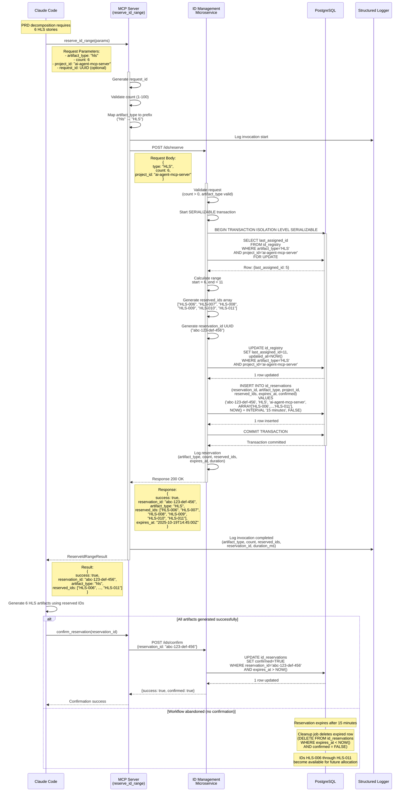

---

## Backend Microservices Architecture

### Overview

The MCP Server architecture includes two backend microservices (implemented in Go) for task management and ID allocation:

1. **Task Tracking Microservice** (US-050)
   - Manages task queue (pending, in_progress, completed)
   - Provides REST API for task CRUD operations
   - Persists tasks in PostgreSQL `tasks` table
   - Enables multi-project task isolation

2. **ID Management Microservice** (US-051)
   - Centralized artifact ID allocation
   - Guarantees globally unique IDs with zero collisions
   - Supports ID range reservations for batch generation
   - Persists ID state in PostgreSQL `id_registry` and `id_reservations` tables

### Architecture Diagram

```mermaid
graph TB
    subgraph "AI Agent (Python)"
        CC[Claude Code]
    end

    subgraph "MCP Server (Python + FastMCP)"
        Val[validate_artifact Tool]
        Res[resolve_artifact_path Tool]
        Store[store_artifact Tool]
        Task[add_task Tool]
        GetID[get_next_available_id Tool]
        ResID[reserve_id_range Tool]
    end

    subgraph "Backend Microservices (Go)"
        TaskAPI[Task Tracking API<br/>:8080]
        IDAPI[ID Management API<br/>:8081]
    end

    subgraph "Data Layer (PostgreSQL)"
        TaskDB[(tasks table)]
        IDDB[(id_registry table<br/>id_reservations table)]
    end

    subgraph "Filesystem"
        FS[Validation Checklists<br/>Artifact Storage]
    end

    CC -->|MCP Protocol| Val
    CC -->|MCP Protocol| Res
    CC -->|MCP Protocol| Store
    CC -->|MCP Protocol| Task
    CC -->|MCP Protocol| GetID
    CC -->|MCP Protocol| ResID

    Val -->|Read JSON| FS
    Res -->|Glob Search| FS
    Store -->|Atomic Write| FS

    Task -->|HTTP POST<br/>/tasks/batch| TaskAPI
    GetID -->|HTTP GET<br/>/ids/next| IDAPI
    ResID -->|HTTP POST<br/>/ids/reserve| IDAPI

    TaskAPI -->|SQL INSERT/UPDATE| TaskDB
    IDAPI -->|SQL UPDATE<br/>(SERIALIZABLE)| IDDB
```

---

## Backend Microservice REST API Specifications

### Task Tracking Microservice REST API (US-050)

**Base URL:** `http://localhost:8080` (configurable)
**Implementation:** Go with chi/gin HTTP framework
**Database:** PostgreSQL 15+ with pgx connection pool

#### Endpoints

**1. GET /tasks/next**
```http
GET /tasks/next?project={project_id}&status={status_filter}
```

**Query Parameters:**
- `project` (required): Project ID (e.g., "ai-agent-mcp-server")
- `status` (optional): Status filter (default: "pending")

**Response 200 OK:**
```json
{
  "success": true,
  "task": {
    "task_id": "TASK-051",
    "project_id": "ai-agent-mcp-server",
    "description": "Generate PRD-006",
    "generator_name": "prd-generator",
    "status": "pending",
    "inputs": ["EPIC-006"],
    "expected_outputs": ["PRD-006"],
    "context_notes": "New session CX required",
    "created_at": "2025-10-18T10:00:00Z"
  }
}
```

**Response 200 OK (No tasks):**
```json
{
  "success": true,
  "task": null,
  "message": "No pending tasks for project"
}
```

**Response 400 Bad Request:**
```json
{
  "success": false,
  "error": "Missing required parameter: project"
}
```

---

**2. PUT /tasks/{task_id}/status**
```http
PUT /tasks/TASK-051/status
Content-Type: application/json

{
  "status": "completed",
  "completion_notes": "PRD-006 v1 generated, 26/26 validation passed"
}
```

**Request Body:**
- `status` (required): New status ("pending", "in_progress", "completed")
- `completion_notes` (optional): Completion notes

**Response 200 OK:**
```json
{
  "success": true,
  "updated_task": {
    "task_id": "TASK-051",
    "status": "completed",
    "completed_at": "2025-10-18T11:00:00Z",
    "completion_notes": "PRD-006 v1 generated, 26/26 validation passed"
  }
}
```

**Response 404 Not Found:**
```json
{
  "success": false,
  "error": "Task not found: TASK-051"
}
```

**Response 400 Bad Request:**
```json
{
  "success": false,
  "error": "Invalid status transition: completed → pending"
}
```

---

**3. GET /tasks**
```http
GET /tasks?project={project_id}&status={status_filter}
```

**Query Parameters:**
- `project` (required): Project ID
- `status` (optional): Status filter

**Response 200 OK:**
```json
{
  "success": true,
  "tasks": [
    {
      "task_id": "TASK-050",
      "project_id": "ai-agent-mcp-server",
      "description": "Generate EPIC-006",
      "status": "completed",
      "completed_at": "2025-10-16T15:00:00Z"
    },
    {
      "task_id": "TASK-051",
      "project_id": "ai-agent-mcp-server",
      "description": "Generate PRD-006",
      "status": "in_progress"
    }
  ],
  "count": 2
}
```

---

**4. POST /tasks/batch**
```http
POST /tasks/batch
Content-Type: application/json

{
  "tasks": [
    {
      "task_id": "TASK-046",
      "project_id": "ai-agent-mcp-server",
      "description": "Generate HLS-006",
      "generator_name": "hls-generator",
      "status": "pending",
      "inputs": ["PRD-006"],
      "expected_outputs": ["HLS-006"],
      "context_notes": ""
    },
    {
      "task_id": "TASK-047",
      "project_id": "ai-agent-mcp-server",
      "description": "Generate HLS-007",
      "generator_name": "hls-generator",
      "status": "pending",
      "inputs": ["PRD-006"],
      "expected_outputs": ["HLS-007"],
      "context_notes": ""
    }
  ]
}
```

**Response 200 OK:**
```json
{
  "success": true,
  "tasks_added": 2,
  "task_ids": ["TASK-046", "TASK-047"]
}
```

**Response 400 Bad Request:**
```json
{
  "success": false,
  "error": "Validation error: missing required field 'task_id' in task 1"
}
```

---

### ID Management Microservice REST API (US-051)

**Base URL:** `http://localhost:8081` (configurable)
**Implementation:** Go with chi/gin HTTP framework
**Database:** PostgreSQL 15+ with pgx connection pool + SERIALIZABLE isolation

#### Endpoints

**1. GET /ids/next**
```http
GET /ids/next?type={artifact_type}&project={project_id}
```

**Query Parameters:**
- `type` (required): Artifact type (US, SPEC, TASK, EPIC, PRD, HLS, VIS, INIT, SPIKE, ADR)
- `project` (required): Project ID (e.g., "ai-agent-mcp-server")

**Response 200 OK:**
```json
{
  "success": true,
  "artifact_type": "US",
  "next_id": "US-028",
  "last_assigned": "US-027"
}
```

**Response 400 Bad Request:**
```json
{
  "success": false,
  "error": "Invalid artifact_type: INVALID. Valid types: US, SPEC, TASK, EPIC, PRD, HLS, VIS, INIT, SPIKE, ADR"
}
```

**Implementation Details:**
- Uses SERIALIZABLE transaction isolation
- FOR UPDATE lock on id_registry row
- Atomic increment operation
- Latency target: p95 <100ms

---

**2. POST /ids/reserve**
```http
POST /ids/reserve
Content-Type: application/json

{
  "type": "US",
  "count": 6,
  "project_id": "ai-agent-mcp-server"
}
```

**Request Body:**
- `type` (required): Artifact type (US, SPEC, etc.)
- `count` (required): Number of IDs to reserve (1-100)
- `project_id` (required): Project ID

**Response 200 OK:**
```json
{
  "success": true,
  "reservation_id": "a1b2c3d4-e5f6-7890-abcd-ef1234567890",
  "artifact_type": "US",
  "reserved_ids": ["US-028", "US-029", "US-030", "US-031", "US-032", "US-033"],
  "expires_at": "2025-10-18T14:30:00Z"
}
```

**Response 400 Bad Request:**
```json
{
  "success": false,
  "error": "Invalid count: must be between 1 and 100"
}
```

**Implementation Details:**
- Single SERIALIZABLE transaction updates id_registry AND inserts id_reservations
- Default expiration: 15 minutes (configurable via RESERVATION_EXPIRATION_MINUTES env var)
- Zero collision guarantee with concurrent requests

---

**3. POST /ids/confirm**
```http
POST /ids/confirm
Content-Type: application/json

{
  "reservation_id": "a1b2c3d4-e5f6-7890-abcd-ef1234567890"
}
```

**Request Body:**
- `reservation_id` (required): UUID from POST /ids/reserve response

**Response 200 OK:**
```json
{
  "success": true,
  "reservation_id": "a1b2c3d4-e5f6-7890-abcd-ef1234567890",
  "confirmed": true
}
```

**Response 404 Not Found:**
```json
{
  "success": false,
  "error": "Reservation expired or not found"
}
```

**Implementation Details:**
- Updates confirmed flag to TRUE
- Only succeeds if expires_at > NOW()
- Prevents automatic cleanup of confirmed reservations

---

**4. DELETE /ids/reservations/expired** (Internal cleanup endpoint)
```http
DELETE /ids/reservations/expired
```

**Response 200 OK:**
```json
{
  "success": true,
  "deleted_count": 5
}
```

**Implementation Details:**
- Deletes rows WHERE expires_at < NOW() AND confirmed = FALSE
- Called by cron job (every 5 minutes recommended)
- Releases unused IDs back to pool

---

## Complete Database Schemas

### PostgreSQL Database: mcp_task_tracking

#### Table: tasks

```sql
CREATE TABLE tasks (
    task_id VARCHAR(20) PRIMARY KEY,           -- TASK-051, TASK-052, etc.
    project_id VARCHAR(100) NOT NULL,          -- ai-agent-mcp-server
    artifact_id VARCHAR(20) NOT NULL,          -- HLS-006, US-040, etc.
    artifact_type VARCHAR(50) NOT NULL,        -- hls, backlog_story, etc.
    generator VARCHAR(100) NOT NULL,           -- hls-generator, backlog-story-generator
    parent_id VARCHAR(20),                     -- PRD-006, HLS-006, etc.
    status VARCHAR(20) NOT NULL,               -- pending, in_progress, completed
    description TEXT,                          -- "Generate HLS-006 from PRD-006"
    inputs TEXT[],                             -- ["PRD-006"]
    expected_outputs TEXT[],                   -- ["HLS-006"]
    context_notes TEXT,                        -- "New session CX required"
    created_at TIMESTAMP DEFAULT NOW(),
    updated_at TIMESTAMP DEFAULT NOW(),
    started_at TIMESTAMP,
    completed_at TIMESTAMP,
    completion_notes TEXT,

    INDEX idx_status (status),
    INDEX idx_project_artifact (project_id, artifact_id),
    INDEX idx_parent_id (parent_id),
    INDEX idx_project_status (project_id, status)
);
```

**Status Transition Rules:**
- `pending` → `in_progress` (allowed)
- `in_progress` → `completed` (allowed)
- `completed` → `pending` (rejected, unless explicit reset flag)

---

#### Table: id_registry

```sql
CREATE TABLE id_registry (
    id SERIAL PRIMARY KEY,
    project_id VARCHAR(100) NOT NULL,          -- ai-agent-mcp-server
    artifact_type VARCHAR(10) NOT NULL,        -- US, SPEC, TASK, EPIC, PRD, HLS, VIS, INIT, SPIKE, ADR
    last_assigned_id INT NOT NULL DEFAULT 0,   -- Last allocated ID number (e.g., 70 for US-070)
    created_at TIMESTAMP DEFAULT NOW(),
    updated_at TIMESTAMP DEFAULT NOW(),

    UNIQUE (project_id, artifact_type)         -- One sequence per project+type
);
```

**Example Rows:**
```sql
INSERT INTO id_registry (project_id, artifact_type, last_assigned_id) VALUES
('ai-agent-mcp-server', 'US', 70),     -- Next: US-071
('ai-agent-mcp-server', 'SPEC', 1),    -- Next: SPEC-002
('ai-agent-mcp-server', 'TASK', 11),   -- Next: TASK-012
('ai-agent-mcp-server', 'HLS', 11),    -- Next: HLS-012
('ai-agent-mcp-server', 'EPIC', 6),    -- Next: EPIC-007
('ai-agent-mcp-server', 'PRD', 6);     -- Next: PRD-007
```

---

#### Table: id_reservations

```sql
CREATE TABLE id_reservations (
    reservation_id UUID PRIMARY KEY DEFAULT gen_random_uuid(),
    project_id VARCHAR(100) NOT NULL,
    artifact_type VARCHAR(10) NOT NULL,
    reserved_ids TEXT[] NOT NULL,              -- ["US-028", "US-029", ..., "US-033"]
    confirmed BOOLEAN DEFAULT FALSE,           -- TRUE if confirmed, FALSE if pending
    expires_at TIMESTAMP NOT NULL,             -- NOW() + INTERVAL '15 minutes'
    created_at TIMESTAMP DEFAULT NOW(),

    INDEX idx_expiration (expires_at) WHERE confirmed = FALSE  -- Partial index for cleanup query
);
```

**Example Row:**
```sql
INSERT INTO id_reservations VALUES (
    'a1b2c3d4-e5f6-7890-abcd-ef1234567890',
    'ai-agent-mcp-server',
    'US',
    ARRAY['US-028', 'US-029', 'US-030', 'US-031', 'US-032', 'US-033'],
    FALSE,
    '2025-10-18T14:45:00Z',
    '2025-10-18T14:30:00Z'
);
```

**Cleanup Query (cron job every 5 minutes):**
```sql
DELETE FROM id_reservations
WHERE expires_at < NOW()
  AND confirmed = FALSE;
```

---

## Summary

This comprehensive sequence diagram documentation covers:

### MCP Tools (Python + FastMCP)
1. **validate_artifact**: Deterministic validation with checklist caching and three-tier validation (automated/agent/manual)
2. **resolve_artifact_path**: Artifact URI resolution with filesystem glob pattern matching
3. **store_artifact**: Centralized artifact storage with metadata extraction and atomic writes
4. **add_task**: Task queue population with Task Tracking microservice integration and retry logic
5. **get_next_available_id**: Globally unique ID allocation via ID Management microservice
6. **reserve_id_range**: Batch ID reservation with expiration and confirmation

### Backend Microservices (Go + PostgreSQL)
1. **Task Tracking Microservice** (Port 8080):
   - GET /tasks/next - Retrieve next pending task
   - PUT /tasks/{id}/status - Update task status
   - GET /tasks - Query tasks with filtering
   - POST /tasks/batch - Batch task addition

2. **ID Management Microservice** (Port 8081):
   - GET /ids/next - Get next available ID (SERIALIZABLE isolation)
   - POST /ids/reserve - Reserve ID range with expiration
   - POST /ids/confirm - Confirm reservation (prevent expiration)
   - DELETE /ids/reservations/expired - Cleanup expired reservations

### Key Architectural Patterns
- **MCP Protocol**: Claude Code ↔ MCP Server communication
- **HTTP/REST**: MCP Server ↔ Backend Microservices communication
- **Pydantic Validation**: Input/output schemas for MCP tools
- **SERIALIZABLE Isolation**: Zero ID collision guarantee with concurrent requests
- **Structured Logging**: Request correlation via request_id across all components
- **Retry Logic**: Exponential backoff for transient failures (connection errors, 503 errors)
- **Atomic Operations**: File writes (temp + rename), database transactions (all-or-nothing)
- **Performance Targets**: Tools <500ms p95, Microservices <200ms p99

### Database Tables
- **tasks**: Task queue (pending, in_progress, completed)
- **id_registry**: Artifact ID sequences (per project + type)
- **id_reservations**: ID range reservations with expiration

---

**Generated:** 2025-10-19
**Based On:**
- US-040 (v2), US-041 (v2), US-042 (v2), US-043 (v2) - MCP Tools
- US-044 (v1), US-045 (v1), US-046 (v1), US-047 (v1) - Additional MCP Tools
- US-050 (v1) - Task Tracking REST API Implementation (Go)
- US-051 (v1) - ID Management REST API Implementation (Go)
