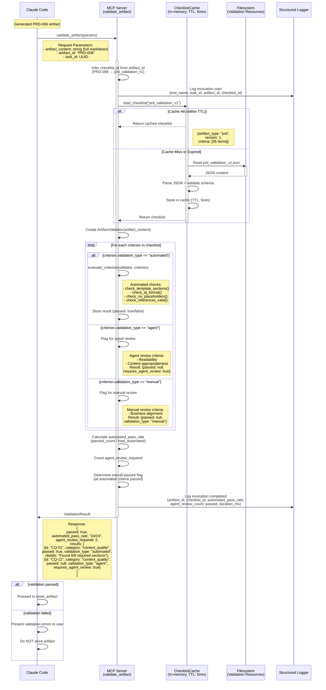
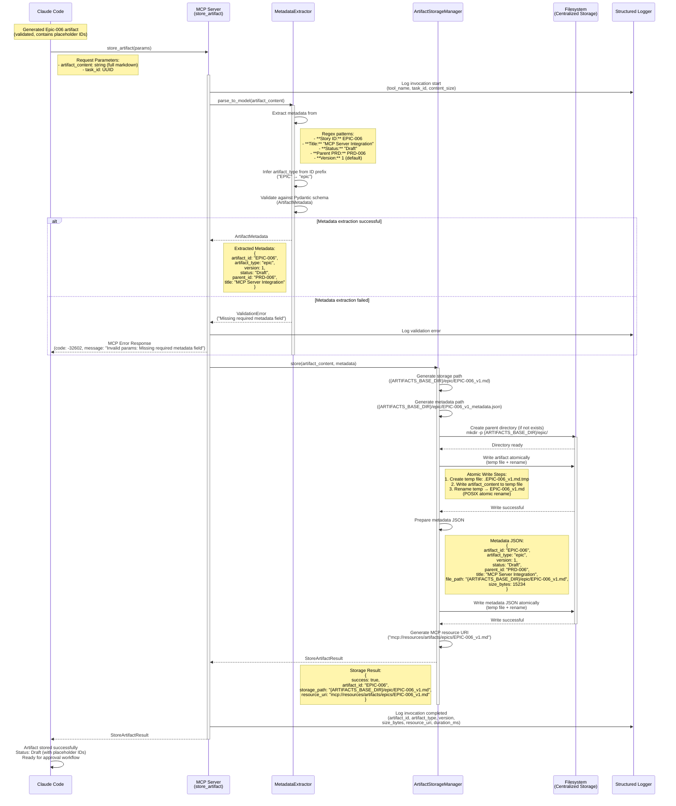
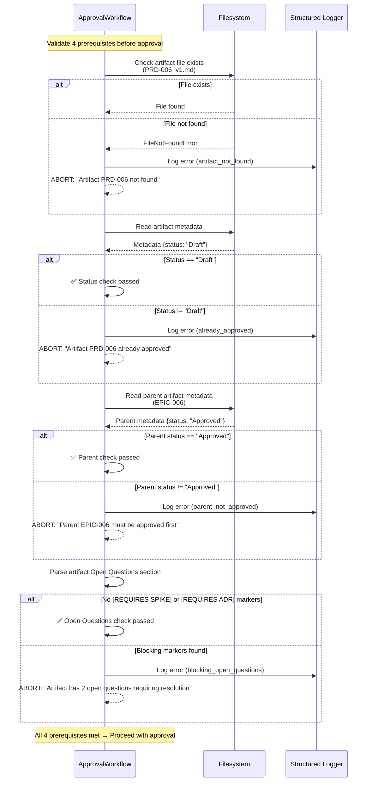
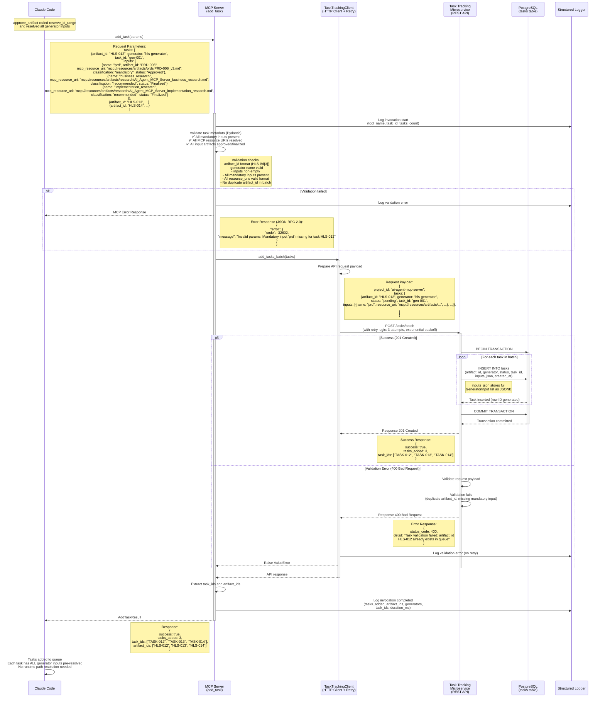
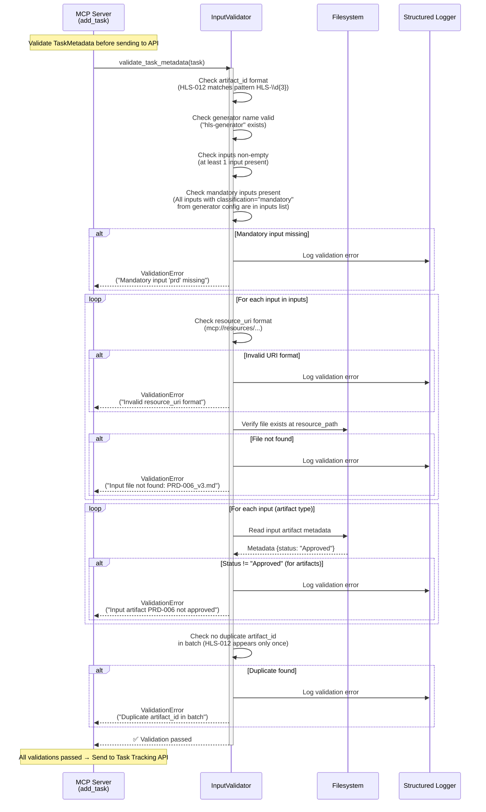
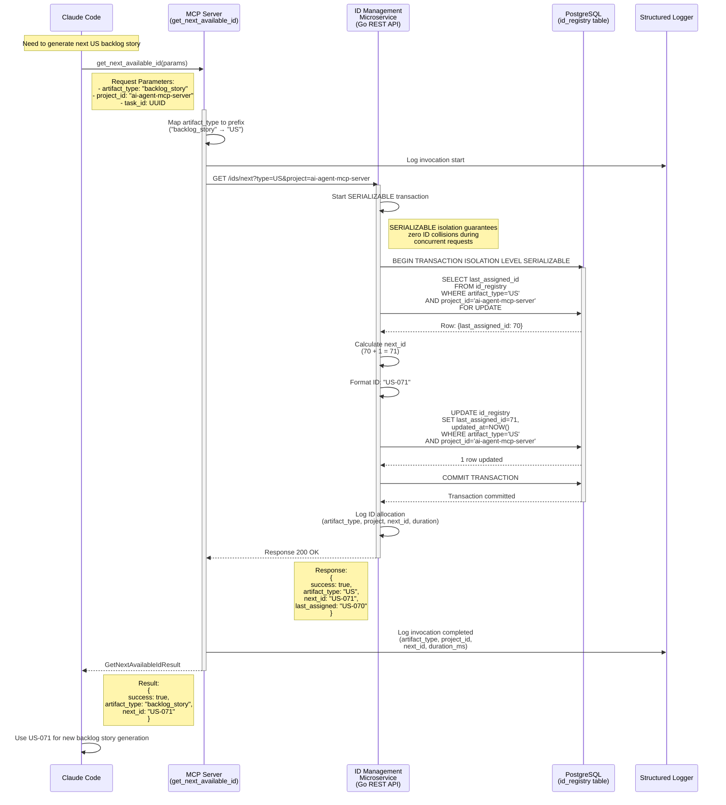
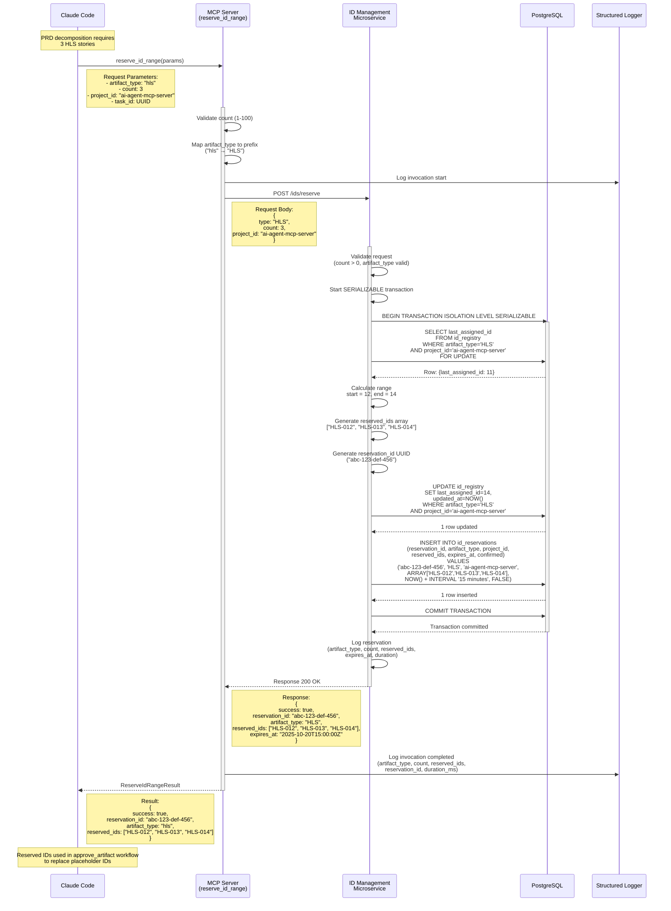
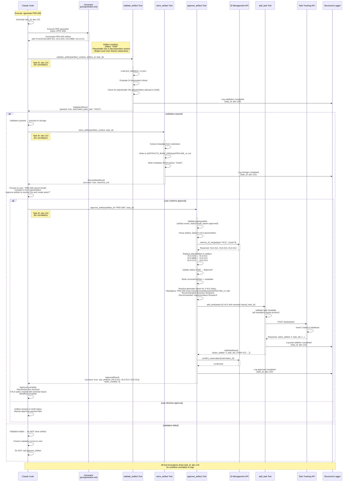

# MCP Tools Sequence Diagram - Detailed Communication Flow

**Purpose:** Comprehensive sequence diagram showing request/response flow between AI Agent (Claude Code), MCP Server Tools, and backend microservices.

**Version:** 3.1
**Date:** 2025-10-20
**Changes from v3.0:**
- **ADDED:** Error Handling (MCP Protocol) section with JSON-RPC 2.0 error format documentation (SPIKE-001 findings)
- **UPDATED:** All error responses to use MCP error format (removed HTTPException references)
- **ADDED:** Error code mapping table and correct/incorrect error handling patterns

**Changes from v2.0 (v3.0):**
- **REMOVED:** resolve_artifact_path tool (deprecated, replaced by approve_artifact)
- **ADDED:** approve_artifact tool with placeholder ID resolution workflow
- **UPDATED:** add_task TaskMetadata schema to include resolved generator inputs (List[GeneratorInput])
- **UPDATED:** Workflow shows placeholder IDs → reserve_id_range → artifact correction → add_task

**Based On:**
- US-040 through US-047 (MCP Tools - Validation and Path Resolution)
- US-050 (Task Tracking REST API Implementation)
- US-051 (ID Management REST API Implementation)
- US-071 (approve_artifact Tool - NEW)
- US-072 (add_task Input Validation Enhancement - NEW)
- Feedback: `/feedback/new_work_feedback.md` (2025-10-20)

---

## Overview

This document provides detailed sequence diagrams for all MCP tools showing:
- Request parameters
- Response structures
- Error handling paths (MCP JSON-RPC 2.0 format)
- Backend microservice interactions
- Database operations (for Task Tracking and ID Registry)

**Tool Inventory (6 tools):**
1. **validate_artifact** - Validates generated artifacts against structured checklists
2. ~~**resolve_artifact_path**~~ - DEPRECATED (replaced by approve_artifact)
3. **store_artifact** - Stores artifacts to centralized storage
4. **add_task** - Adds tasks with RESOLVED generator inputs (MCP resource URIs)
5. **approve_artifact** - NEW: Approves artifacts, resolves placeholder IDs, creates sub-artifact tasks
6. **get_next_available_id** - Retrieves next available artifact ID
7. **reserve_id_range** - Reserves contiguous ID range for batch generation

---

## Error Handling (MCP Protocol)

### MCP Error Response Format (JSON-RPC 2.0)

**Decision:** SPIKE-001 - MCP Error Response Format Investigation (2025-10-20)

All MCP tools use **JSON-RPC 2.0 error format** with automatic exception conversion via FastMCP ErrorHandlingMiddleware. **Do NOT use FastAPI HTTPException** as it bypasses MCP protocol compliance.

#### Error Response Structure

```json
{
  "jsonrpc": "2.0",
  "id": 1,
  "error": {
    "code": -32602,
    "message": "Invalid params: Resource name contains path traversal",
    "data": {
      "resource_name": "../etc/passwd",
      "validation_failed": "path_traversal_check"
    }
  }
}
```

#### Standard Error Codes

| Python Exception | JSON-RPC Code | Error Message Format | Use Case |
|------------------|---------------|----------------------|----------|
| FileNotFoundError | -32001 | "Resource not found: {message}" | Missing artifacts, missing validation checklists |
| ValueError | -32602 | "Invalid params: {message}" | Invalid artifact ID format, path traversal attempt |
| TypeError | -32602 | "Invalid params: {message}" | Invalid parameter type |
| PermissionError | -32000 | "Permission denied: {message}" | Filesystem permission denied |
| TimeoutError | -32000 | "Request timeout: {message}" | API timeout, database timeout |
| Other exceptions | -32603 | "Internal error: {message}" | Unexpected errors |

**Reference:** MCP Specification 2025-03-26, FastMCP ErrorHandlingMiddleware

#### Recommended Error Handling Pattern

**✅ CORRECT - Use Standard Python Exceptions:**
```python
from pathlib import Path
import aiofiles

@app.get("/mcp/resources/artifacts/{artifact_id}")
async def get_artifact_resource(artifact_id: str):
    # Validation → ValueError → -32602
    if ".." in artifact_id or artifact_id.startswith("/"):
        raise ValueError("Invalid artifact ID: path traversal detected")

    # Check existence → FileNotFoundError → -32001
    artifact_path = Path(ARTIFACTS_BASE_DIR) / f"{artifact_id}.md"
    if not artifact_path.exists():
        raise FileNotFoundError(
            f"Resource not found: mcp://resources/artifacts/{artifact_id}"
        )

    # Read file → PermissionError/IOError → -32000/-32603
    async with aiofiles.open(artifact_path, mode='r') as f:
        content = await f.read()

    return {"uri": f"mcp://resources/artifacts/{artifact_id}", "content": content}
```

**❌ INCORRECT - Do NOT Use HTTPException:**
```python
from fastapi import HTTPException  # ❌ DO NOT USE

@app.get("/mcp/resources/artifacts/{artifact_id}")
async def get_artifact_resource(artifact_id: str):
    if not artifact_path.exists():
        # ❌ HTTPException bypasses FastMCP error conversion
        raise HTTPException(status_code=404, detail="Not found")
```

#### FastMCP ErrorHandlingMiddleware

FastMCP automatically converts Python exceptions to MCP-compatible JSON-RPC error responses. **No custom exception handlers needed.**

**Source:** `fastmcp.server.middleware.error_handling.ErrorHandlingMiddleware`

**Key Benefits:**
- Automatic error code mapping (predictable conversion)
- MCP protocol compliance (JSON-RPC 2.0 structure)
- Simpler implementation (no custom exception handlers)
- Type-safe error handling (Python exception types → JSON-RPC codes)

**Security Logging:**
```python
if ".." in artifact_id:
    logger.warning(
        "Path traversal attempt detected",
        extra={"artifact_id": artifact_id, "tool_name": "validate_artifact"}
    )
    raise ValueError("Invalid artifact ID")
```

**References:**
- **SPIKE-001:** `/artifacts/spikes/SPIKE-001_mcp_error_response_format_v1.md`
- **MCP Specification:** https://modelcontextprotocol.io/specification/2025-03-26/basic/lifecycle
- **FastMCP Error Handling:** https://gofastmcp.com/python-sdk/fastmcp-server-middleware-error_handling

---

## Tool 1: validate_artifact

### Purpose
Validates generated artifacts against structured validation checklists with deterministic criteria evaluation.

### Participants
- **Claude Code** (AI Agent)
- **MCP Server** (FastMCP Tool)
- **Validation Resources** (JSON checklists on filesystem)
- **ChecklistCache** (In-memory cache, TTL: 5 minutes)

### Request Flow



---

## Tool 2: store_artifact

### Purpose
Stores generated artifacts to centralized storage with metadata extraction and atomic writes.

### Participants
- **Claude Code** (AI Agent)
- **MCP Server** (FastMCP Tool)
- **MetadataExtractor** (Parses artifact markdown)
- **ArtifactStorageManager** (Storage logic)
- **Filesystem** (Centralized storage directory)

### Request Flow



---

## Tool 3: approve_artifact (NEW)

### Purpose
Approves Draft artifacts, resolves placeholder IDs via reserve_id_range, updates artifact with final IDs, and creates sub-artifact tasks with RESOLVED generator inputs.

### Participants
- **Claude Code** (AI Agent)
- **MCP Server** (FastMCP Tool)
- **ApprovalWorkflow** (Orchestrates approval process)
- **ID Management Microservice** (reserve_id_range API)
- **Filesystem** (Artifact storage)
- **add_task Tool** (Task creation with resolved inputs)

### Request Flow



```mermaid
sequenceDiagram
    participant CC as Claude Code
    participant MCP as MCP Server<br/>(approve_artifact)
    participant Workflow as ApprovalWorkflow
    participant FS as Filesystem
    participant IDAPI as ID Management<br/>Microservice
    participant AddTask as add_task Tool
    participant Log as Structured Logger

    Note over CC: PRD-006 artifact generated<br/>Status: Draft<br/>Contains placeholder IDs: HLS-AAA, HLS-BBB, HLS-CCC

    CC->>MCP: approve_artifact(params)
    Note right of CC: Request Parameters:<br/>- artifact_id: "PRD-006"<br/>- task_id: UUID

    activate MCP
    MCP->>Log: Log invocation start<br/>(tool_name, task_id, artifact_id)

    MCP->>Workflow: execute_approval(artifact_id)
    activate Workflow

    %% Step 1: Load and validate artifact
    Workflow->>FS: Load artifact PRD-006_v1.md
    activate FS
    FS-->>Workflow: Artifact content + metadata
    deactivate FS

    Workflow->>Workflow: Validate approval prerequisites<br/>1. Artifact exists<br/>2. Status = "Draft"<br/>3. Parent artifact approved (EPIC-006 status = "Approved")<br/>4. No blocking Open Questions

    alt Prerequisites not met
        Workflow->>Log: Log validation error
        Workflow-->>MCP: ApprovalError
        MCP-->>CC: MCP Error Response<br/>(code: -32000, message: "Parent EPIC-006 not approved")
        Note over CC: Approval blocked
    end

    %% Step 2: Parse artifact to detect sub-artifacts
    Workflow->>Workflow: Parse artifact content<br/>Extract placeholder IDs:<br/>- HLS-AAA, HLS-BBB, HLS-CCC

    Workflow->>Workflow: Determine sub-artifact type:<br/>"hls" (High-Level Story)

    Workflow->>Workflow: Count sub-artifacts: 3

    %% Step 3: Reserve ID range
    Workflow->>IDAPI: reserve_id_range(type="HLS", count=3)
    activate IDAPI
    Note right of Workflow: POST /ids/reserve<br/>{<br/>  type: "HLS",<br/>  count: 3,<br/>  project_id: "ai-agent-mcp-server"<br/>}

    IDAPI->>IDAPI: SERIALIZABLE transaction<br/>Reserve HLS-012, HLS-013, HLS-014
    IDAPI-->>Workflow: ReserveIdRangeResult
    deactivate IDAPI
    Note left of IDAPI: Response:<br/>{<br/>  success: true,<br/>  reservation_id: "abc-123-def",<br/>  reserved_ids: ["HLS-012", "HLS-013", "HLS-014"],<br/>  expires_at: "2025-10-20T15:00:00Z"<br/>}

    %% Step 4: Update artifact with final IDs
    Workflow->>Workflow: Map placeholders to reserved IDs<br/>HLS-AAA → HLS-012<br/>HLS-BBB → HLS-013<br/>HLS-CCC → HLS-014

    Workflow->>FS: Read artifact content
    activate FS
    FS-->>Workflow: Original artifact with placeholders
    deactivate FS

    Workflow->>Workflow: Replace all placeholder references<br/>HLS-AAA → HLS-012 (in decomposition, dependencies)<br/>HLS-BBB → HLS-013<br/>HLS-CCC → HLS-014

    Workflow->>FS: Write corrected artifact atomically<br/>(temp file + rename)
    activate FS
    FS-->>Workflow: Write successful
    deactivate FS

    %% Step 5: Update artifact status to Approved
    Workflow->>Workflow: Update metadata Status:<br/>"Draft" → "Approved"

    Workflow->>FS: Write updated metadata JSON
    activate FS
    FS-->>Workflow: Metadata updated
    deactivate FS

    %% Step 6: Resolve generator inputs for sub-artifacts
    Note over Workflow: For each sub-artifact (HLS-012, HLS-013, HLS-014),<br/>resolve ALL generator inputs

    loop For each sub-artifact
        Workflow->>Workflow: Read hls-generator input requirements<br/>(from generator config - prepared during migration)

        Workflow->>Workflow: Resolve mandatory inputs:<br/>- PRD-006 (parent artifact, now Approved)<br/>  Path: artifacts/prds/PRD-006_v3.md<br/>  URI: mcp://resources/artifacts/prds/PRD-006_v3.md

        Workflow->>Workflow: Resolve recommended inputs:<br/>- Business Research<br/>  Path: artifacts/research/AI_Agent_MCP_Server_business_research.md<br/>  URI: mcp://resources/artifacts/research/AI_Agent_MCP_Server_business_research.md<br/>- Implementation Research<br/>  Path: artifacts/research/AI_Agent_MCP_Server_implementation_research.md<br/>  URI: mcp://resources/artifacts/research/AI_Agent_MCP_Server_implementation_research.md

        Workflow->>Workflow: Construct TaskMetadata with resolved inputs:<br/>{<br/>  artifact_id: "HLS-012",<br/>  generator: "hls-generator",<br/>  task_id: "generated-task-001",<br/>  inputs: [<br/>    {name: "prd", artifact_id: "PRD-006",<br/>     resource_uri: "mcp://resources/artifacts/prds/PRD-006_v3.md", ...},<br/>    {name: "business_research", ..., },<br/>    {name: "implementation_research", ..., }<br/>  ]<br/>}
    end

    %% Step 7: Call add_task with resolved inputs
    Workflow->>AddTask: add_task(tasks=[3 HLS tasks with resolved inputs])
    activate AddTask
    Note right of Workflow: 3 tasks with complete generator inputs<br/>(all MCP resource URIs resolved)

    AddTask->>AddTask: Validate task metadata<br/>(all mandatory inputs present)
    AddTask->>AddTask: Send to Task Tracking API
    AddTask-->>Workflow: AddTaskResult<br/>(tasks_added: 3, task_ids: [TASK-012, TASK-013, TASK-014])
    deactivate AddTask

    %% Step 8: Confirm ID reservation
    Workflow->>IDAPI: confirm_reservation(reservation_id)
    activate IDAPI
    IDAPI->>IDAPI: UPDATE id_reservations<br/>SET confirmed=TRUE
    IDAPI-->>Workflow: Confirmation success
    deactivate IDAPI

    Workflow-->>MCP: ApprovalResult
    deactivate Workflow
    Note left of Workflow: Approval Result:<br/>{<br/>  success: true,<br/>  artifact_id: "PRD-006",<br/>  old_status: "Draft",<br/>  new_status: "Approved",<br/>  artifact_path: "artifacts/prds/PRD-006_v3.md",<br/>  sub_artifacts_detected: ["HLS-012", "HLS-013", "HLS-014"],<br/>  tasks_created: 3,<br/>  task_ids: ["TASK-012", "TASK-013", "TASK-014"]<br/>}

    MCP->>Log: Log invocation completed<br/>(artifact_id, old_status, new_status,<br/>sub_artifacts_count, tasks_created, duration_ms)

    MCP-->>CC: ApprovalResult
    deactivate MCP

    CC->>CC: Artifact approved successfully<br/>Placeholder IDs resolved<br/>Sub-artifact tasks created with resolved inputs
```

### Approval Prerequisites Validation



---

## Tool 4: add_task (UPDATED)

### Purpose
Adds tasks to Task Tracking microservice queue with RESOLVED generator inputs (all MCP resource URIs pre-resolved).

### Participants
- **Claude Code** (AI Agent)
- **MCP Server** (FastMCP Tool)
- **TaskTrackingClient** (HTTP client with retry logic)
- **Task Tracking Microservice** (REST API)
- **PostgreSQL Database** (Task persistence)

### Updated TaskMetadata Schema

**OLD Schema (v2):**
```python
class TaskMetadata(BaseModel):
    artifact_id: str      # "HLS-012"
    parent_id: str        # "PRD-006"
    task_id: str
```

**NEW Schema (v3):**
```python
class TaskMetadata(BaseModel):
    artifact_id: str              # "HLS-012" (output to generate)
    generator: str                # "hls-generator"
    task_id: str                  # UUID
    inputs: List[GeneratorInput]  # ALL resolved inputs (mandatory + recommended)

class GeneratorInput(BaseModel):
    name: str                     # "prd" (from generator config)
    classification: str           # "mandatory" | "recommended" | "conditional"
    artifact_type: str            # "prd"
    artifact_id: str              # "PRD-006"
    resource_path: str            # "artifacts/prds/PRD-006_v3.md"
    mcp_resource_uri: str         # "mcp://resources/artifacts/prds/PRD-006_v3.md"
    status: str                   # "Approved"
```

### Request Flow



### add_task Input Validation (NEW)



---

## Tool 5: get_next_available_id

### Purpose
Retrieves next available artifact ID from ID Management microservice for globally unique ID allocation.

### Participants
- **Claude Code** (AI Agent)
- **MCP Server** (FastMCP Tool)
- **ID Management Microservice** (Go REST API)
- **PostgreSQL Database** (id_registry table)

### Request Flow



---

## Tool 6: reserve_id_range

### Purpose
Reserves contiguous ID range for batch artifact generation (e.g., 6 HLS stories) with 15-minute expiration.

### Participants
- **Claude Code** (AI Agent)
- **MCP Server** (FastMCP Tool)
- **ID Management Microservice** (Go REST API)
- **PostgreSQL Database** (id_registry and id_reservations tables)

### Request Flow



---

## End-to-End Workflow: Generate PRD → Validate → Store → Approve → Add Tasks

### Complete Workflow with approve_artifact



---

## Logging and Observability

### Structured Log Output (JSON)

All tool invocations produce structured JSON logs with standard fields:

#### Example: approve_artifact Log Entry (NEW)

```json
{
  "timestamp": "2025-10-20T14:30:05.123Z",
  "event": "approve_artifact_invocation_completed",
  "tool_name": "approve_artifact",
  "task_id": "abc-123-def-456",
  "artifact_id": "PRD-006",
  "old_status": "Draft",
  "new_status": "Approved",
  "placeholder_ids_replaced": 3,
  "id_mapping": {
    "HLS-AAA": "HLS-012",
    "HLS-BBB": "HLS-013",
    "HLS-CCC": "HLS-014"
  },
  "reservation_id": "xyz-789-abc-012",
  "sub_artifacts_detected": ["HLS-012", "HLS-013", "HLS-014"],
  "tasks_created": 3,
  "task_ids": ["TASK-012", "TASK-013", "TASK-014"],
  "success": true,
  "duration_ms": 1234
}
```

#### Example: add_task Log Entry (UPDATED with inputs)

```json
{
  "timestamp": "2025-10-20T14:30:06.789Z",
  "event": "add_task_invocation_completed",
  "tool_name": "add_task",
  "task_id": "abc-123-def-456",
  "tasks_added": 3,
  "artifact_ids": ["HLS-012", "HLS-013", "HLS-014"],
  "generators": ["hls-generator", "hls-generator", "hls-generator"],
  "task_ids": ["TASK-012", "TASK-013", "TASK-014"],
  "inputs_validated": true,
  "mandatory_inputs_count": 1,
  "recommended_inputs_count": 2,
  "success": true,
  "duration_ms": 342
}
```

---

## Database Schema Updates

### PostgreSQL Database: mcp_task_tracking

#### Table: tasks (UPDATED with inputs_json)

```sql
CREATE TABLE tasks (
    task_id VARCHAR(20) PRIMARY KEY,           -- TASK-012, TASK-013, etc.
    project_id VARCHAR(100) NOT NULL,          -- ai-agent-mcp-server
    artifact_id VARCHAR(20) NOT NULL,          -- HLS-012, US-040, etc.
    generator VARCHAR(100) NOT NULL,           -- hls-generator, backlog-story-generator
    status VARCHAR(20) NOT NULL,               -- pending, in_progress, completed
    description TEXT,                          -- "Generate HLS-012 from PRD-006"

    -- NEW: Store resolved generator inputs as JSONB
    inputs_json JSONB NOT NULL,                -- [{name: "prd", artifact_id: "PRD-006", resource_uri: "mcp://resources/artifacts/...", ...}, ...]

    created_at TIMESTAMP DEFAULT NOW(),
    updated_at TIMESTAMP DEFAULT NOW(),
    started_at TIMESTAMP,
    completed_at TIMESTAMP,
    completion_notes TEXT,

    INDEX idx_status (status),
    INDEX idx_project_artifact (project_id, artifact_id),
    INDEX idx_project_status (project_id, status),

    -- NEW: GIN index for JSONB queries (search by input artifact_id)
    INDEX idx_inputs_json USING GIN (inputs_json)
);
```

**Example Row with inputs_json:**
```sql
INSERT INTO tasks VALUES (
    'TASK-012',
    'ai-agent-mcp-server',
    'HLS-012',
    'hls-generator',
    'pending',
    'Generate HLS-012 from PRD-006',
    '[
        {
            "name": "prd",
            "classification": "mandatory",
            "artifact_type": "prd",
            "artifact_id": "PRD-006",
            "resource_path": "artifacts/prds/PRD-006_v3.md",
            "mcp_resource_uri": "mcp://resources/artifacts/prds/PRD-006_v3.md",
            "status": "Approved"
        },
        {
            "name": "business_research",
            "classification": "recommended",
            "artifact_type": "research",
            "artifact_id": "N/A",
            "resource_path": "artifacts/research/AI_Agent_MCP_Server_business_research.md",
            "mcp_resource_uri": "mcp://resources/artifacts/research/AI_Agent_MCP_Server_business_research.md",
            "status": "Finalized"
        },
        {
            "name": "implementation_research",
            "classification": "recommended",
            "artifact_type": "research",
            "artifact_id": "N/A",
            "resource_path": "artifacts/research/AI_Agent_MCP_Server_implementation_research.md",
            "mcp_resource_uri": "mcp://resources/artifacts/research/AI_Agent_MCP_Server_implementation_research.md",
            "status": "Finalized"
        }
    ]'::jsonb,
    '2025-10-20 14:30:06',
    '2025-10-20 14:30:06',
    NULL,
    NULL,
    NULL
);
```

**Query Examples:**
```sql
-- Find all tasks that depend on PRD-006
SELECT * FROM tasks
WHERE inputs_json @> '[{"artifact_id": "PRD-006"}]';

-- Find all tasks missing mandatory inputs
SELECT * FROM tasks
WHERE NOT EXISTS (
    SELECT 1 FROM jsonb_array_elements(inputs_json) AS input
    WHERE input->>'classification' = 'mandatory'
);
```

---

## Backend Microservices Architecture (UPDATED)

### Overview

The MCP Server architecture includes two backend microservices (implemented in Go) for task management and ID allocation:

1. **Task Tracking Microservice** (US-050)
   - Manages task queue (pending, in_progress, completed)
   - Provides REST API for task CRUD operations
   - Persists tasks in PostgreSQL `tasks` table **with inputs_json (JSONB)**
   - Enables multi-project task isolation

2. **ID Management Microservice** (US-051)
   - Centralized artifact ID allocation
   - Guarantees globally unique IDs with zero collisions
   - Supports ID range reservations for batch generation (used by approve_artifact)
   - Persists ID state in PostgreSQL `id_registry` and `id_reservations` tables

### Architecture Diagram (UPDATED)

```mermaid
graph TB
    subgraph "AI Agent (Python)"
        CC[Claude Code]
    end

    subgraph "MCP Server (Python + FastMCP)"
        Val[validate_artifact Tool]
        Store[store_artifact Tool]
        Approve[approve_artifact Tool<br/>NEW]
        Task[add_task Tool<br/>UPDATED: inputs validation]
        GetID[get_next_available_id Tool]
        ResID[reserve_id_range Tool]
    end

    subgraph "Backend Microservices (Go)"
        TaskAPI[Task Tracking API<br/>:8080]
        IDAPI[ID Management API<br/>:8081]
    end

    subgraph "Data Layer (PostgreSQL)"
        TaskDB[(tasks table<br/>NEW: inputs_json JSONB)]
        IDDB[(id_registry table<br/>id_reservations table)]
    end

    subgraph "Filesystem"
        FS[Validation Checklists<br/>Artifact Storage<br/>ARTIFACTS_BASE_DIR]
    end

    CC -->|MCP Protocol| Val
    CC -->|MCP Protocol| Store
    CC -->|MCP Protocol| Approve
    CC -->|MCP Protocol| Task
    CC -->|MCP Protocol| GetID
    CC -->|MCP Protocol| ResID

    Val -->|Read JSON| FS
    Store -->|Atomic Write| FS
    Approve -->|Read/Write<br/>Placeholder Replacement| FS

    Approve -->|reserve_id_range| IDAPI
    Approve -->|add_task| Task
    Task -->|HTTP POST<br/>/tasks/batch| TaskAPI
    GetID -->|HTTP GET<br/>/ids/next| IDAPI
    ResID -->|HTTP POST<br/>/ids/reserve| IDAPI

    TaskAPI -->|SQL INSERT/UPDATE<br/>inputs_json JSONB| TaskDB
    IDAPI -->|SQL UPDATE<br/>(SERIALIZABLE)| IDDB
```

---

## Key Architectural Changes

### v3.1 Changes (Error Handling)

#### **MCP Error Response Format** (NEW - SPIKE-001)
- **Decision:** Use JSON-RPC 2.0 error format with FastMCP ErrorHandlingMiddleware automatic conversion
- **Eliminates:** FastAPI HTTPException usage (breaks MCP protocol compliance)
- **Benefits:**
  - MCP protocol compliance (JSON-RPC 2.0 structure)
  - Automatic error code mapping (Python exceptions → JSON-RPC codes)
  - Simpler implementation (no custom exception handlers)
  - Type-safe error handling (predictable conversion)
- **Error Codes:**
  - FileNotFoundError → -32001 (Resource not found)
  - ValueError/TypeError → -32602 (Invalid params)
  - PermissionError/TimeoutError → -32000 (Application error)
  - Other exceptions → -32603 (Internal error)
- **Reference:** `/artifacts/spikes/SPIKE-001_mcp_error_response_format_v1.md`

### v3.0 Changes (Approval Workflow)

#### 1. **approve_artifact Tool** (NEW)
- **Purpose:** Orchestrates approval workflow: validate prerequisites → reserve IDs → replace placeholders → resolve generator inputs → create tasks
- **Eliminates:** Manual ID assignment and placeholder resolution
- **Benefits:** Atomic approval process, guaranteed ID uniqueness, self-contained tasks with resolved inputs

#### 2. **resolve_artifact_path Tool** (DEPRECATED)
- **Reason:** Path resolution now embedded in approve_artifact workflow
- **Replacement:** approve_artifact internally resolves all paths during task creation
- **Migration:** Existing workflows using resolve_artifact_path should migrate to approve_artifact

#### 3. **add_task TaskMetadata Schema** (UPDATED)
- **OLD:** Simple parent_id reference
- **NEW:** Full `inputs: List[GeneratorInput]` with ALL resolved MCP resource URIs
- **Benefits:**
  - Self-contained tasks (no runtime path resolution)
  - Validation at task creation time (all mandatory inputs present)
  - Audit trail (task contains snapshot of input artifacts)

#### 4. **Placeholder ID Workflow** (NEW)
- **Step 1:** Generator produces artifact with placeholder IDs (HLS-AAA, HLS-BBB)
- **Step 2:** Artifact stored in Draft status with placeholders
- **Step 3:** approve_artifact calls reserve_id_range to get final IDs
- **Step 4:** Placeholders replaced in artifact (HLS-AAA → HLS-012)
- **Step 5:** Tasks created with resolved inputs
- **Step 6:** Reservation confirmed

#### 5. **No Dynamic XML Parsing** (CLARIFICATION)
- **Assumption:** Generator input requirements prepared during migration process
- **Implementation:** approve_artifact reads pre-configured input mappings (not dynamic XML parsing)
- **Trade-off:** Simpler runtime, requires migration step to prepare input configurations

---

## Summary

This comprehensive sequence diagram documentation covers:

### MCP Tools (Python + FastMCP)
1. **validate_artifact**: Deterministic validation with checklist caching (artifact_id inference)
2. ~~**resolve_artifact_path**~~: DEPRECATED (replaced by approve_artifact)
3. **store_artifact**: Centralized artifact storage (ARTIFACTS_BASE_DIR separation)
4. **add_task**: Task queue population with RESOLVED generator inputs (List[GeneratorInput])
5. **approve_artifact**: NEW - Approval orchestration with placeholder ID resolution
6. **get_next_available_id**: Globally unique ID allocation
7. **reserve_id_range**: Batch ID reservation with expiration (used by approve_artifact)

### Backend Microservices (Go + PostgreSQL)
1. **Task Tracking Microservice** (Port 8080):
   - GET /tasks/next - Retrieve next pending task
   - PUT /tasks/{id}/status - Update task status
   - GET /tasks - Query tasks with filtering
   - POST /tasks/batch - Batch task addition (with inputs_json JSONB)

2. **ID Management Microservice** (Port 8081):
   - GET /ids/next - Get next available ID (SERIALIZABLE isolation)
   - POST /ids/reserve - Reserve ID range with expiration (approve_artifact integration)
   - POST /ids/confirm - Confirm reservation (prevent expiration)
   - DELETE /ids/reservations/expired - Cleanup expired reservations

### Key Architectural Patterns
- **MCP Protocol**: Claude Code ↔ MCP Server communication
- **HTTP/REST**: MCP Server ↔ Backend Microservices communication
- **Pydantic Validation**: Input/output schemas with inference (artifact_id → checklist_id)
- **SERIALIZABLE Isolation**: Zero ID collision guarantee with concurrent requests
- **Structured Logging**: Request correlation via task_id across all components
- **Placeholder ID Workflow**: Draft with placeholders → reserve_id_range → correction → approved with final IDs
- **Resolved Generator Inputs**: Tasks contain ALL inputs as MCP resource URIs (no runtime path resolution)
- **Atomic Operations**: File writes (temp + rename), database transactions (all-or-nothing)
- **Performance Targets**: Tools <500ms p95, Microservices <200ms p99

### Database Tables
- **tasks**: Task queue with inputs_json JSONB (resolved generator inputs)
- **id_registry**: Artifact ID sequences (per project + type)
- **id_reservations**: ID range reservations with expiration (15 minutes)

---

**Generated:** 2025-10-20
**Version:** 3.1 (Updated with SPIKE-001 error handling findings)
**Changes from v3.0:**
- Added comprehensive "Error Handling (MCP Protocol)" section documenting JSON-RPC 2.0 error format
- Updated all error responses to use MCP error format (removed HTTPException references)
- Added error code mapping table (Python exceptions → JSON-RPC codes)
- Added correct/incorrect error handling patterns with code examples
- Referenced SPIKE-001 findings for error handling decisions

**Based On:**
- US-040 (v3), US-041 (v3), US-042 (v3 - deprecated), US-043 (v3) - MCP Tools
- US-044 (v3), US-045 (v2), US-046 (v2), US-047 (v3) - Additional MCP Tools
- US-050 (v1) - Task Tracking REST API Implementation (Go)
- US-051 (v1) - ID Management REST API Implementation (Go)
- **US-071 (NEW)** - approve_artifact Tool Implementation
- **US-072 (NEW)** - add_task Input Validation Enhancement
- **SPIKE-001** - MCP Error Response Format Investigation (2025-10-20)
- Feedback: `/feedback/new_work_feedback.md` (2025-10-20)
