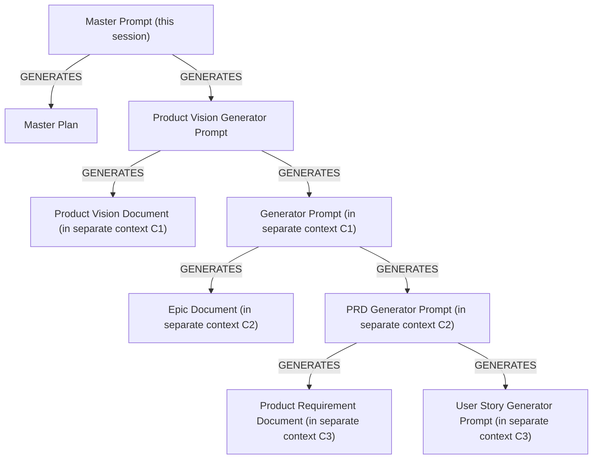

```mermaid
graph TD;
    A["Master Prompt (this session)"] -->|GENERATES| P[Master Plan];
    A -->|GENERATES| PVP[Product Vision Generator Prompt];

    PVP -->|GENERATES| PVD["Product Vision Document (in separate context C1)"] 
    PVP -->|GENERATES| EP["Generator Prompt (in separate context C1)"]

    EP -->|GENERATES| ED["Epic Document (in separate context C2)"] 
    EP -->|GENERATES| PRP["PRD Generator Prompt (in separate context C2)"]

    PRP -->|GENERATES| PRD["Product Requirement Document (in separate context C3)"] 
    PRP -->|GENERATES| USP["User Story Generator Prompt (in separate context C3)"]

```